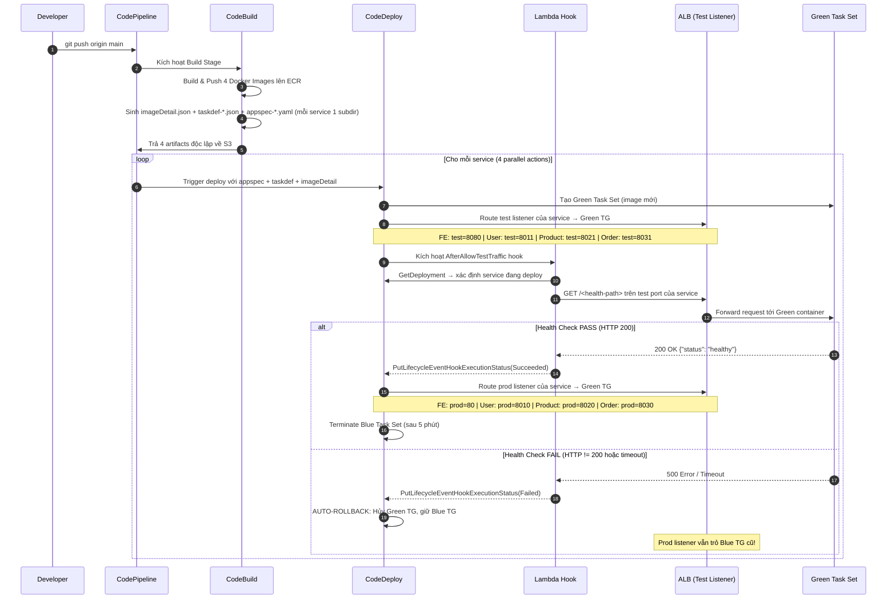

# 🚀 HƯỚNG DẪN THỰC HÀNH LAB: TRIỂN KHAI CI/CD MICROSERVICES (1 FE + 3 BE) LÊN AWS ECS FARGATE VỚI BLUE/GREEN DEPLOYMENT

> **Môn học:** NT548 - Công nghệ DevOps và Ứng dụng  
> **Cấp độ:** Thực hành Lab Trực quan (Step-by-step Hands-on Guide)  
> **Mục tiêu:** Xây dựng hoàn chỉnh luồng CI/CD: Push code ➔ Tự động Build 4 Docker Images ➔ Push ECR ➔ Deploy lên AWS ECS Fargate bằng **Blue/Green Deployment** (có Lambda Lifecycle Hook tự động kiểm tra Health API và Auto-Rollback khi lỗi).  
> *(Phiên bản tinh gọn: 1 nhánh, 1 Region, không Quality Gate/Approval)*

---

## 📑 MỤC LỤC

1. [Tổng Quan Kiến Trúc & Sơ Đồ Hệ Thống](#1-tổng-quan-kiến-trúc--sơ-đồ-hệ-thống)
2. [Thiết Kế Ứng Dụng: 1 FE + 3 BE Services](#2-thiết-kế-ứng-dụng-1-fe--3-be-services)
3. [Cấu Trúc Thư Mục Dự Án (Monorepo)](#3-cấu-trúc-thư-mục-dự-án-monorepo)
4. [Mã Nguồn Chi Tiết & Dockerfile Từng Dịch Vụ](#4-mã-nguồn-chi-tiết--dockerfile-từng-dịch-vụ)
   - [4.1. Frontend Service](#41-dịch-vụ-frontend-frontend)
   - [4.2. User Service](#42-dịch-vụ-backend-1-user-service-be-user-service)
   - [4.3. Product Service](#43-dịch-vụ-backend-2-product-service-be-product-service)
   - [4.4. Order Service](#44-dịch-vụ-backend-3-order-service-be-order-service)
   - [4.5. Docker Compose (Local Dev)](#45-chạy-thử-nghiệm-local-bằng-docker-compose)
5. [Khởi Tạo Hạ Tầng AWS](#5-khởi-tạo-hạ-tầng-aws)
   - [Bước 5.0: Tạo IAM Roles](#bước-50-tạo-iam-roles-cần-thiết)
   - [Bước 5.1: Tạo ECR Repositories](#bước-51-tạo-4-repositories-trên-amazon-ecr)
   - [Bước 5.2: Cấu hình ALB & Target Groups](#bước-52-cấu-hình-alb-dual-listener--8-target-groups)
   - [Bước 5.3: Tạo ECS Cluster & Services](#bước-53-tạo-ecs-cluster--4-ecs-fargate-services-với-codedeploycontroller)
   - [Bước 5.4: Tạo CodeDeploy Applications & Deployment Groups](#bước-54-tạo-4-codedeploy-applications--deployment-groups)
6. [Xây Dựng CI/CD Pipeline](#6-xây-dựng-full-bluegreen-pipeline-với-lambda-health-hook)
   - [6.1. Cơ chế Lambda Hook](#61-cơ-chế-hoạt-động-của-lambda-lifecycle-hook)
   - [6.2. Mã nguồn Lambda](#62-mã-nguồn-hàm-aws-lambda)
   - [6.3. Kịch bản buildspec.yml](#63-kịch-bản-codebuild-buildspecyml)
   - [6.4. Cấu hình CodePipeline](#64-cấu-hình-codepipeline)
7. [Kiểm Thử Nghiệm Thu](#7-kiểm-thử-nghiệm-thu-test-bluegreen--auto-rollback)
8. [Troubleshooting](#8-troubleshooting---xử-lý-lỗi-thường-gặp)
9. [Dọn Dẹp Tài Nguyên](#9-dọn-dẹp-tài-nguyên-clean-up)

---

## 1. TỔNG QUAN KIẾN TRÚC & SƠ ĐỒ HỆ THỐNG

Hệ thống được chia thành **4 container độc lập**:
* **1 Container Frontend (FE):** Web UI (Nginx), phục vụ người dùng cuối tại `/`.
* **3 Container Backend (BE)** tách biệt theo tính năng:
  1. `user-service` (Port 5001): Quản lý người dùng (`/api/users/*`).
  2. `product-service` (Port 5002): Quản lý sản phẩm (`/api/products/*`).
  3. `order-service` (Port 5003): Quản lý đơn hàng (`/api/orders/*`).

### Sơ đồ định tuyến ALB với Blue/Green (8 Listeners Độc Lập):

```
                                  Internet
                                     │
                                     ▼
                            [ ALB nt548-alb ]
                                     │
     ┌───────────────────────────────┼───────────────────────────────┐
     │                               │                               │
     ▼                               ▼                               ▼
FE Service                      User Service                   Product Service                 Order Service
Prod :80                        Prod :8010                     Prod :8020                      Prod :8030
Test :8080                      Test :8011                     Test :8021                      Test :8031
     │                               │                               │                               │
TG Blue/Green                   TG Blue/Green                   TG Blue/Green                   TG Blue/Green
     │                               │                               │                               │
     └───────────────────────────────┴───────────────────────────────┴───────────────────────────────┘
                                     │
                                     ▼
                    +─────────── ECS Fargate ───────────+
```

### Sơ đồ luồng xử lý Runtime Frontend (Reverse Proxy):

```
Browser (Người dùng)
   │
   ▼
ALB :80 (Production Listener FE)
   │
   ▼
FE Nginx Container
   ├── Phục vụ Static Web UI (HTML/CSS/JS) tại /
   ├── /api/users    ──► ALB :8010 ──► user-service:5001
   ├── /api/products ──► ALB :8020 ──► product-service:5002
   └── /api/orders   ──► ALB :8030 ──► order-service:5003
```

> **Ghi chú quan trọng về Blue/Green:** CodeDeploy **không tạo hay xóa** Listener của ALB trong mỗi lần deployment. Thay vào đó, CodeDeploy **cập nhật action của listener** tương ứng (Production Listener và Test Listener riêng của từng service) để chuyển traffic từ Target Group hiện tại sang Target Group mới (replacement task set). Sau khi deployment hoàn thành, Production Listener sẽ trỏ sang Green TG, còn Test Listener trỏ sang Blue TG (sẵn sàng cho lần deploy tiếp theo).

### Sơ đồ luồng CI/CD Pipeline (Blue/Green):

```
[Developer Push Code]
        │ (git push origin main)
        ▼
[GitHub / CodeCommit Repository]
        │ (Webhook kích hoạt tự động)
        ▼
[AWS CodeBuild]
   ├── 1. Build & Push 4 Docker Images lên ECR (tag: commit hash)
   └── 2. Sinh 4 artifact bộ độc lập (mỗi bộ có thư mục riêng):
       Fe:      appspec-fe.yaml + taskdef-fe.json + imageDetail.json
       User:    appspec-user.yaml + taskdef-user.json + imageDetail.json
       Product: appspec-product.yaml + taskdef-product.json + imageDetail.json
       Order:   appspec-order.yaml + taskdef-order.json + imageDetail.json
        │
        ▼
[AWS CodePipeline - Stage Deploy]
   4 Actions chạy song song (hoặc tuần tự theo runOrder):
   ├── Action 1: CodeDeploy → AppSpec fe-service      (FeDeployArtifact)
   ├── Action 2: CodeDeploy → AppSpec user-service    (UserDeployArtifact)
   ├── Action 3: CodeDeploy → AppSpec product-service (ProductDeployArtifact)
   └── Action 4: CodeDeploy → AppSpec order-service   (OrderDeployArtifact)
        │
        ▼ (Cho mỗi service, CodeDeploy thực hiện:)
[AWS CodeDeploy - ECS Blue/Green]
   ├── 1. Đăng ký TaskDef mới (CodePipeline thay <IMAGE1_NAME> bằng URI từ imageDetail.json)
   ├── 2. Tạo Green Task Set mới và gán vào Green TG
   ├── 3. Chuyển Test Listener của service sang Green TG (FE:8080, User:8011, Prod:8021, Order:8031)
   ├── 4. Kích hoạt Lambda Hook AfterAllowTestTraffic
   │      └── Lambda gọi http://ALB:<TestPort>/<health-endpoint>
   │          ├── [200 OK] → Báo Succeeded → CodeDeploy swap Production Listener sang Green TG
   │          └── [Lỗi]   → Báo Failed  → Deployment đánh dấu Failed
   │                                      → (Nếu auto-rollback bật) CodeDeploy revert traffic về Blue TG
   └── 5. (Nếu pass) Terminate Blue Task Set cũ sau thời gian chờ (5 phút)
```

---

## 2. THIẾT KẾ ỨNG DỤNG: 1 FE + 3 BE SERVICES

| Tên Service | Vai Trò | Công Nghệ | Port | ALB Route | Health Check |
| :--- | :--- | :--- | :--- | :--- | :--- |
| **frontend** | Giao diện Dashboard | Nginx + HTML/JS | `80` | `/*` | `GET /health` |
| **user-service** | Quản lý Người dùng | Node.js / Express | `5001` | `/api/users*` | `GET /api/users/health` |
| **product-service** | Danh mục Sản phẩm | Python / Flask | `5002` | `/api/products*` | `GET /api/products/health` |
| **order-service** | Quản lý Đơn hàng | Node.js / Express | `5003` | `/api/orders*` | `GET /api/orders/health` |

| CodeDeploy App | Deployment Group | Prod Listener | Test Listener | Production TG | Test TG |
| :--- | :--- | :--- | :--- | :--- | :--- |
| `app-fe` | `app-fe-dg` | port `80` | port `8080` | `tg-fe-blue` | `tg-fe-green` |
| `app-user` | `app-user-dg` | port `8010` | port `8011` | `tg-user-blue` | `tg-user-green` |
| `app-product` | `app-product-dg` | port `8020` | port `8021` | `tg-product-blue` | `tg-product-green` |
| `app-order` | `app-order-dg` | port `8030` | port `8031` | `tg-order-blue` | `tg-order-green` |

> **Tại sao mỗi service có cặp listener riêng?** CodeDeploy Deployment Group cấu hình `prodTrafficRoute` và `testTrafficRoute` theo **Listener ARN** — không cho phép chỉ định riêng một Listener Rule ARN. Vì vậy nếu 4 Deployment Groups cùng dùng chung Listener 80/8080, CodeDeploy của từng service có thể can thiệp lẫn nhau khi deploy song song. Mỗi service được cấp một cặp listener (prod + test) độc lập để tránh xung đột.

---

## 3. CẤU TRÚC THƯ MỤC DỰ ÁN (MONOREPO)

```
lab-microservices-cicd/
├── docker-compose.yml              # Chạy thử toàn bộ hệ thống trên máy local
├── buildspec.yml                   # Kịch bản CI/CD: build images & sinh artifacts
│
├── frontend/                       # DỊCH VỤ 1: FRONTEND UI
│   ├── nginx.conf.template         # Cấu hình Nginx Web Server (dùng template ${ALB_DNS})
│   ├── Dockerfile
│   └── src/
│       ├── index.html
│       └── app.js
│
├── be-user-service/                # DỊCH VỤ 2: USER SERVICE
│   ├── package.json
│   ├── server.js
│   └── Dockerfile
│
├── be-product-service/             # DỊCH VỤ 3: PRODUCT SERVICE
│   ├── requirements.txt
│   ├── app.py
│   └── Dockerfile
│
└── be-order-service/               # DỊCH VỤ 4: ORDER SERVICE
    ├── package.json
    ├── server.js
    └── Dockerfile
```

> **Lưu ý:** Các file `taskdef-*.json` và `appspec-*.yaml` được **sinh tự động** bởi `buildspec.yml` trong quá trình build, không cần commit vào repo.

---

## 4. MÃ NGUỒN CHI TIẾT & DOCKERFILE TỪNG DỊCH VỤ

### 4.1. Dịch vụ Frontend (`frontend/`)

#### File: `frontend/src/index.html`
```html
<!DOCTYPE html>
<html lang="vi">
<head>
  <meta charset="UTF-8">
  <meta name="viewport" content="width=device-width, initial-scale=1.0">
  <title>Microservices Dashboard - NT548 DevOps Lab</title>
  <link href="https://cdn.jsdelivr.net/npm/bootstrap@5.3.0/dist/css/bootstrap.min.css" rel="stylesheet">
  <style>
    body { background-color: #f8f9fa; }
    .card { box-shadow: 0 4px 6px rgba(0,0,0,0.1); border-radius: 12px; }
    .badge-service { font-size: 0.85rem; }
  </style>
</head>
<body>
  <nav class="navbar navbar-dark bg-primary mb-4">
    <div class="container">
      <span class="navbar-brand mb-0 h1">🏛️ NT548 - DevOps Microservices Platform (1 FE + 3 BE)</span>
      <span class="badge bg-light text-primary">AWS ECS Fargate | Blue/Green</span>
    </div>
  </nav>

  <div class="container">
    <div class="alert alert-info" role="alert">
      <strong>Mô hình định tuyến:</strong> Trình duyệt gửi request tới ALB ➔ ALB tự động phân bổ:
      <code>/api/users</code> (Node.js) | <code>/api/products</code> (Python) | <code>/api/orders</code> (Node.js)
    </div>

    <div class="row g-4">
      <!-- 1. USER SERVICE CARD -->
      <div class="col-md-4">
        <div class="card h-100 border-primary">
          <div class="card-header bg-primary text-white d-flex justify-content-between align-items-center">
            <span>👤 User Service</span>
            <span class="badge bg-light text-dark badge-service">Port 5001</span>
          </div>
          <div class="card-body">
            <p class="text-muted">Quản lý danh sách tài khoản sinh viên / khách hàng.</p>
            <button class="btn btn-outline-primary btn-sm mb-3" onclick="loadUsers()">Tải lại danh sách User</button>
            <ul id="user-list" class="list-group list-group-flush">
              <li class="list-group-item text-muted">Đang tải dữ liệu...</li>
            </ul>
          </div>
        </div>
      </div>

      <!-- 2. PRODUCT SERVICE CARD -->
      <div class="col-md-4">
        <div class="card h-100 border-success">
          <div class="card-header bg-success text-white d-flex justify-content-between align-items-center">
            <span>📦 Product Service</span>
            <span class="badge bg-light text-dark badge-service">Port 5002</span>
          </div>
          <div class="card-body">
            <p class="text-muted">Quản lý kho hàng & danh mục sản phẩm đồ án.</p>
            <button class="btn btn-outline-success btn-sm mb-3" onclick="loadProducts()">Tải lại sản phẩm</button>
            <ul id="product-list" class="list-group list-group-flush">
              <li class="list-group-item text-muted">Đang tải dữ liệu...</li>
            </ul>
          </div>
        </div>
      </div>

      <!-- 3. ORDER SERVICE CARD -->
      <div class="col-md-4">
        <div class="card h-100 border-warning">
          <div class="card-header bg-warning text-dark d-flex justify-content-between align-items-center">
            <span>🛒 Order Service</span>
            <span class="badge bg-dark text-white badge-service">Port 5003</span>
          </div>
          <div class="card-body">
            <p class="text-muted">Quản lý đơn đặt hàng & trạng thái thanh toán.</p>
            <button class="btn btn-outline-warning text-dark btn-sm mb-3" onclick="loadOrders()">Tải lại đơn hàng</button>
            <ul id="order-list" class="list-group list-group-flush">
              <li class="list-group-item text-muted">Đang tải dữ liệu...</li>
            </ul>
          </div>
        </div>
      </div>
    </div>
  </div>

  <script src="app.js"></script>
</body>
</html>
```

#### File: `frontend/src/app.js`
```javascript
async function loadUsers() {
  const container = document.getElementById('user-list');
  try {
    const res = await fetch('/api/users');
    const data = await res.json();
    container.innerHTML = data.map(u => `
      <li class="list-group-item">
        <strong>${u.name}</strong> <br>
        <small class="text-muted">${u.email} - Vai trò: ${u.role}</small>
      </li>
    `).join('');
  } catch (err) {
    container.innerHTML = `<li class="list-group-item list-group-item-danger">Lỗi kết nối User Service: ${err.message}</li>`;
  }
}

async function loadProducts() {
  const container = document.getElementById('product-list');
  try {
    const res = await fetch('/api/products');
    const data = await res.json();
    container.innerHTML = data.map(p => `
      <li class="list-group-item d-flex justify-content-between align-items-center">
        <div>
          <strong>${p.name}</strong><br>
          <small class="text-muted">${p.category}</small>
        </div>
        <span class="badge bg-success rounded-pill">$${p.price}</span>
      </li>
    `).join('');
  } catch (err) {
    container.innerHTML = `<li class="list-group-item list-group-item-danger">Lỗi kết nối Product Service: ${err.message}</li>`;
  }
}

async function loadOrders() {
  const container = document.getElementById('order-list');
  try {
    const res = await fetch('/api/orders');
    const data = await res.json();
    container.innerHTML = data.map(o => `
      <li class="list-group-item">
        <strong>Đơn hàng: #${o.order_id}</strong><br>
        <small>Khách: ${o.customer} | Tổng: $${o.total}</small><br>
        <span class="badge ${o.status === 'COMPLETED' ? 'bg-primary' : 'bg-info text-dark'}">${o.status}</span>
      </li>
    `).join('');
  } catch (err) {
    container.innerHTML = `<li class="list-group-item list-group-item-danger">Lỗi kết nối Order Service: ${err.message}</li>`;
  }
}

// Tự động gọi cả 3 service khi load trang web
window.onload = () => {
  loadUsers();
  loadProducts();
  loadOrders();
};
```

#### File: `frontend/nginx.conf.template`
```nginx
server {
    listen 80;
    server_name localhost;

    # ① Phục vụ Static Files (index.html, JS, CSS)
    location / {
        root /usr/share/nginx/html;
        index index.html index.htm;
        try_files $uri $uri/ /index.html;
    }

    # ② Reverse Proxy cho Backend APIs — chuyển request tới từng service qua ALB
    # Biến ${ALB_DNS} được ECS Task Definition truyền vào lúc runtime
    # Nginx official image tự động chạy envsubst khi container khởi động
    location /api/users {
        proxy_pass http://${ALB_DNS}:8010;
        proxy_set_header Host $host;
        proxy_set_header X-Real-IP $remote_addr;
        proxy_connect_timeout 5s;
        proxy_read_timeout 30s;
    }

    location /api/products {
        proxy_pass http://${ALB_DNS}:8020;
        proxy_set_header Host $host;
        proxy_set_header X-Real-IP $remote_addr;
        proxy_connect_timeout 5s;
        proxy_read_timeout 30s;
    }

    location /api/orders {
        proxy_pass http://${ALB_DNS}:8030;
        proxy_set_header Host $host;
        proxy_set_header X-Real-IP $remote_addr;
        proxy_connect_timeout 5s;
        proxy_read_timeout 30s;
    }

    # ③ Health check endpoint cho ALB Target Group
    location /health {
        access_log off;
        return 200 "healthy\n";
        add_header Content-Type text/plain;
    }
}
```

> **💡 Tại sao dùng template + `envsubst` thay vì bake DNS vào image?**  
> Trong quy trình dựng hệ thống, Docker image frontend bootstrap được build và push lên ECR **trước khi** ALB được tạo ra. Nếu hard-code DNS của ALB vào `nginx.conf`, image ban đầu sẽ không có DNS hợp lệ. Bằng cách dùng template `nginx.conf.template`, image FE hoàn toàn generic; DNS thực tế của ALB sẽ được truyền linh hoạt qua biến môi trường `ALB_DNS` trong ECS Task Definition lúc runtime. Nginx official image (từ bản 1.19+) có sẵn script `/docker-entrypoint.d/20-envsubst-on-templates.sh` tự động render các file trong `/etc/nginx/templates/*.template` thành file cấu hình chính `/etc/nginx/conf.d/*.conf`.

#### File: `frontend/Dockerfile`
```dockerfile
FROM nginx:alpine
# Copy template vào thư mục templates của Nginx
# Entrypoint mặc định của Nginx sẽ tự động chạy envsubst thay thế ${ALB_DNS}
# và sinh ra /etc/nginx/conf.d/default.conf khi container khởi chạy
COPY nginx.conf.template /etc/nginx/templates/default.conf.template
COPY src/ /usr/share/nginx/html/
EXPOSE 80
CMD ["nginx", "-g", "daemon off;"]
```

---

### 4.2. Dịch vụ Backend 1: User Service (`be-user-service/`)

#### File: `be-user-service/package.json`
```json
{
  "name": "be-user-service",
  "version": "1.0.0",
  "main": "server.js",
  "scripts": {
    "start": "node server.js"
  },
  "dependencies": {
    "express": "^4.19.2",
    "cors": "^2.8.5"
  }
}
```

#### File: `be-user-service/server.js`
```javascript
const express = require('express');
const cors = require('cors');
const app = express();
const PORT = process.env.PORT || 5001;

app.use(cors());
app.use(express.json());

// Mock dữ liệu người dùng
const users = [
  { id: 1, name: "Nguyen Van A", email: "vana@uit.edu.vn", role: "DevOps Engineer" },
  { id: 2, name: "Tran Thi B", email: "thib@uit.edu.vn", role: "Cloud Architect" },
  { id: 3, name: "Le Van C", email: "vanc@uit.edu.vn", role: "Site Reliability Engineer" }
];

// Health check endpoint - ALB dùng đường dẫn này để probe
app.get(['/health', '/api/users/health'], (req, res) => {
  res.status(200).json({ status: "healthy", service: "user-service", port: PORT });
});

// Endpoint danh sách users
app.get('/api/users', (req, res) => {
  console.log("[USER-SERVICE] Request danh sách users nhận được.");
  res.json(users);
});

app.listen(PORT, '0.0.0.0', () => {
  console.log(`User Service đang lắng nghe tại port ${PORT}`);
});
```

#### File: `be-user-service/Dockerfile`
```dockerfile
FROM node:18-alpine
WORKDIR /app
COPY package*.json ./
RUN npm install --production
COPY . .
EXPOSE 5001
CMD ["node", "server.js"]
```

---

### 4.3. Dịch vụ Backend 2: Product Service (`be-product-service/`)

#### File: `be-product-service/requirements.txt`
```
Flask==3.0.3
flask-cors==4.0.1
gunicorn==22.0.0
```

#### File: `be-product-service/app.py`
```python
from flask import Flask, jsonify
from flask_cors import CORS
import os

app = Flask(__name__)
CORS(app)

PORT = int(os.environ.get("PORT", 5002))

products = [
    {"id": 101, "name": "AWS Fargate Cluster v2", "category": "Cloud Computing", "price": 49.99},
    {"id": 102, "name": "Terraform Enterprise Blueprint", "category": "DevOps Tools", "price": 89.00},
    {"id": 103, "name": "Docker Swarm & Kubernetes Master", "category": "Containerization", "price": 29.50},
    {"id": 104, "name": "Prometheus & Grafana Alert System", "category": "Observability", "price": 35.00}
]

# Health check endpoint
@app.route('/health', methods=['GET'])
@app.route('/api/products/health', methods=['GET'])
def health():
    return jsonify({"status": "healthy", "service": "product-service", "port": PORT}), 200

# Endpoint danh sách sản phẩm
@app.route('/api/products', methods=['GET'])
def get_products():
    print("[PRODUCT-SERVICE] Request danh sách products nhận được.")
    return jsonify(products), 200

if __name__ == '__main__':
    app.run(host='0.0.0.0', port=PORT)
```

#### File: `be-product-service/Dockerfile`
```dockerfile
FROM python:3.11-slim
WORKDIR /app
COPY requirements.txt .
RUN pip install --no-cache-dir -r requirements.txt
COPY . .
EXPOSE 5002
CMD ["gunicorn", "--bind", "0.0.0.0:5002", "app:app"]
```

---

### 4.4. Dịch vụ Backend 3: Order Service (`be-order-service/`)

#### File: `be-order-service/package.json`
```json
{
  "name": "be-order-service",
  "version": "1.0.0",
  "main": "server.js",
  "scripts": {
    "start": "node server.js"
  },
  "dependencies": {
    "express": "^4.19.2",
    "cors": "^2.8.5"
  }
}
```

#### File: `be-order-service/server.js`
```javascript
const express = require('express');
const cors = require('cors');
const app = express();
const PORT = process.env.PORT || 5003;

app.use(cors());
app.use(express.json());

const orders = [
  { order_id: "ORD-9021", customer: "Nguyen Van A", total: 49.99, status: "COMPLETED" },
  { order_id: "ORD-9022", customer: "Tran Thi B", total: 118.50, status: "PROCESSING" },
  { order_id: "ORD-9023", customer: "Le Van C", total: 35.00, status: "COMPLETED" }
];

// Health check endpoint
app.get(['/health', '/api/orders/health'], (req, res) => {
  res.status(200).json({ status: "healthy", service: "order-service", port: PORT });
});

// Endpoint danh sách orders
app.get('/api/orders', (req, res) => {
  console.log("[ORDER-SERVICE] Request danh sách orders nhận được.");
  res.json(orders);
});

app.listen(PORT, '0.0.0.0', () => {
  console.log(`Order Service đang lắng nghe tại port ${PORT}`);
});
```

#### File: `be-order-service/Dockerfile`
```dockerfile
FROM node:18-alpine
WORKDIR /app
COPY package*.json ./
RUN npm install --production
COPY . .
EXPOSE 5003
CMD ["node", "server.js"]
```

---

### 4.5. Chạy Thử Nghiệm Local Bằng Docker Compose

#### File: `docker-compose.yml`
```yaml
version: "3.8"

services:
  frontend:
    build: ./frontend
    ports:
      - "80:80"
    environment:
      - ALB_DNS=localhost
    depends_on:
      - user-service
      - product-service
      - order-service

  user-service:
    build: ./be-user-service
    ports:
      - "5001:5001"
    environment:
      - PORT=5001

  product-service:
    build: ./be-product-service
    ports:
      - "5002:5002"
    environment:
      - PORT=5002

  order-service:
    build: ./be-order-service
    ports:
      - "5003:5003"
    environment:
      - PORT=5003
```

**Lệnh chạy local:**
```bash
# Khởi động toàn bộ hệ thống
docker compose up --build -d

# Kiểm tra trạng thái
docker compose ps

# Kiểm tra health endpoints
curl http://localhost/health
curl http://localhost:5001/api/users/health
curl http://localhost:5002/api/products/health
curl http://localhost:5003/api/orders/health

# Mở trình duyệt
open http://localhost

# Dừng hệ thống
docker compose down
```

> **Lưu ý:** Trên môi trường local, Frontend không proxy qua ALB. Để test tích hợp đầy đủ, cần cấu hình thêm Nginx reverse proxy local hoặc test từng service riêng lẻ.

---

## 5. KHỞI TẠO HẠ TẦNG AWS

*(Thực hiện 1 lần duy nhất - có thể dùng AWS Console hoặc AWS CLI)*

### Bước 5.0: Tạo IAM Roles Cần Thiết

Hệ thống cần **5 IAM Roles**: 3 roles cho runtime ứng dụng, 2 roles cho CI/CD pipeline.

#### 5.0.1. ECS Task Execution Role (`ecsTaskExecutionRole`)
Role này cho phép Fargate task pull image từ ECR và ghi log vào CloudWatch.

Vào **IAM Console → Roles → Create Role:**
* Trusted entity: `Elastic Container Service Task`
* Attach policy: `AmazonECSTaskExecutionRolePolicy` (managed)
* Tên role: `ecsTaskExecutionRole`

#### 5.0.2. CodeDeploy Role cho ECS (`AWSCodeDeployRoleForECS`)
Role này cho phép CodeDeploy quản lý ECS Services và Target Groups.

```bash
# Tạo trust policy file
cat > codedeploy-trust-policy.json << 'EOF'
{
  "Version": "2012-10-17",
  "Statement": [{
    "Effect": "Allow",
    "Principal": { "Service": "codedeploy.amazonaws.com" },
    "Action": "sts:AssumeRole"
  }]
}
EOF

aws iam create-role \
  --role-name AWSCodeDeployRoleForECS \
  --assume-role-policy-document file://codedeploy-trust-policy.json

aws iam attach-role-policy \
  --role-name AWSCodeDeployRoleForECS \
  --policy-arn arn:aws:iam::aws:policy/AWSCodeDeployRoleForECS
```

#### 5.0.3. Lambda Execution Role (`nt548-lambda-hook-role`)
Role này cho phép hàm Lambda gọi API CodeDeploy để báo kết quả hook và đọc thông tin deployment.

```bash
# Tạo trust policy
cat > lambda-trust-policy.json << 'EOF'
{
  "Version": "2012-10-17",
  "Statement": [{
    "Effect": "Allow",
    "Principal": { "Service": "lambda.amazonaws.com" },
    "Action": "sts:AssumeRole"
  }]
}
EOF

aws iam create-role \
  --role-name nt548-lambda-hook-role \
  --assume-role-policy-document file://lambda-trust-policy.json

# Attach quyền cơ bản Lambda (bao gồm CloudWatch Logs)
aws iam attach-role-policy \
  --role-name nt548-lambda-hook-role \
  --policy-arn arn:aws:iam::aws:policy/service-role/AWSLambdaBasicExecutionRole

# Tạo inline policy cho CodeDeploy
cat > lambda-codedeploy-policy.json << 'EOF'
{
  "Version": "2012-10-17",
  "Statement": [
    {
      "Effect": "Allow",
      "Action": [
        "codedeploy:GetDeployment",
        "codedeploy:PutLifecycleEventHookExecutionStatus"
      ],
      "Resource": "*"
    }
  ]
}
EOF

aws iam put-role-policy \
  --role-name nt548-lambda-hook-role \
  --policy-name codedeploy-hook-policy \
  --policy-document file://lambda-codedeploy-policy.json
```

#### 5.0.4. CodeBuild Service Role (`nt548-codebuild-role`)
CodeBuild cần quyền push image lên ECR và đọc Task Definition từ ECS.

```bash
cat > codebuild-trust-policy.json << 'EOF'
{
  "Version": "2012-10-17",
  "Statement": [{
    "Effect": "Allow",
    "Principal": { "Service": "codebuild.amazonaws.com" },
    "Action": "sts:AssumeRole"
  }]
}
EOF

aws iam create-role \
  --role-name nt548-codebuild-role \
  --assume-role-policy-document file://codebuild-trust-policy.json

# Quyền ECR (push images)
aws iam attach-role-policy \
  --role-name nt548-codebuild-role \
  --policy-arn arn:aws:iam::aws:policy/AmazonEC2ContainerRegistryPowerUser

# Quyền CloudWatch Logs + ECS DescribeTaskDefinition
cat > codebuild-inline-policy.json << 'EOF'
{
  "Version": "2012-10-17",
  "Statement": [
    {
      "Effect": "Allow",
      "Action": [
        "logs:CreateLogGroup",
        "logs:CreateLogStream",
        "logs:PutLogEvents"
      ],
      "Resource": "*"
    },
    {
      "Effect": "Allow",
      "Action": ["ecs:DescribeTaskDefinition"],
      "Resource": "*"
    },
    {
      "Effect": "Allow",
      "Action": ["s3:GetObject", "s3:PutObject", "s3:GetBucketAcl", "s3:GetBucketLocation"],
      "Resource": "*"
    }
  ]
}
EOF

aws iam put-role-policy \
  --role-name nt548-codebuild-role \
  --policy-name codebuild-inline-policy \
  --policy-document file://codebuild-inline-policy.json
```

#### 5.0.5. CodePipeline Service Role (`nt548-codepipeline-role`)
CodePipeline cần quyền trigger CodeBuild, đọc S3 artifacts, và gọi CodeDeploy.

```bash
cat > codepipeline-trust-policy.json << 'EOF'
{
  "Version": "2012-10-17",
  "Statement": [{
    "Effect": "Allow",
    "Principal": { "Service": "codepipeline.amazonaws.com" },
    "Action": "sts:AssumeRole"
  }]
}
EOF

aws iam create-role \
  --role-name nt548-codepipeline-role \
  --assume-role-policy-document file://codepipeline-trust-policy.json

aws iam attach-role-policy \
  --role-name nt548-codepipeline-role \
  --policy-arn arn:aws:iam::aws:policy/AWSCodePipeline_FullAccess

# Cấp thêm quyền gọi CodeDeploy và CodeBuild
cat > codepipeline-inline-policy.json << 'EOF'
{
  "Version": "2012-10-17",
  "Statement": [
    {
      "Effect": "Allow",
      "Action": ["codedeploy:*", "codebuild:*"],
      "Resource": "*"
    },
    {
      "Effect": "Allow",
      "Action": ["s3:*"],
      "Resource": "*"
    },
    {
      "Effect": "Allow",
      "Action": ["iam:PassRole"],
      "Resource": "*",
      "Condition": {
        "StringEqualsIfExists": {
          "iam:PassedToService": ["ecs-tasks.amazonaws.com", "codedeploy.amazonaws.com"]
        }
      }
    }
  ]
}
EOF

aws iam put-role-policy \
  --role-name nt548-codepipeline-role \
  --policy-name codepipeline-inline-policy \
  --policy-document file://codepipeline-inline-policy.json

echo "✅ Đã tạo đủ 5 IAM Roles cần thiết."
```

---

### Bước 5.1: Tạo 4 ECR Repositories & Bootstrap Images

#### 5.1.1. Tạo ECR Repositories

```bash
export AWS_REGION="ap-southeast-1"
export ACCOUNT_ID=$(aws sts get-caller-identity --query Account --output text)
export ECR_REGISTRY="${ACCOUNT_ID}.dkr.ecr.${AWS_REGION}.amazonaws.com"

for REPO in fe-app be-user-service be-product-service be-order-service; do
  aws ecr create-repository \
    --repository-name "$REPO" \
    --region "$AWS_REGION"
  echo "✅ Đã tạo ECR repo: $REPO"
done
```

#### 5.1.2. Bootstrap Images (Bắt Buộc Trước Khi Tạo ECS Services)

> **⚠️ Quan trọng:** ECS Service lần đầu khởi tạo dùng tag `:latest`. Nếu ECR repository rỗng, ECS task sẽ fail với lỗi `CannotPullContainerError`. Phải push ít nhất 1 image bootstrap trước khi tạo ECS Services.

```bash
# Đăng nhập ECR
aws ecr get-login-password --region "$AWS_REGION" | \
  docker login --username AWS --password-stdin "$ECR_REGISTRY"

# Build và push bootstrap images (tag: latest)
docker build -t ${ECR_REGISTRY}/fe-app:latest             ./frontend
docker build -t ${ECR_REGISTRY}/be-user-service:latest    ./be-user-service
docker build -t ${ECR_REGISTRY}/be-product-service:latest ./be-product-service
docker build -t ${ECR_REGISTRY}/be-order-service:latest   ./be-order-service

docker push ${ECR_REGISTRY}/fe-app:latest
docker push ${ECR_REGISTRY}/be-user-service:latest
docker push ${ECR_REGISTRY}/be-product-service:latest
docker push ${ECR_REGISTRY}/be-order-service:latest

echo "✅ Bootstrap images đã push lên ECR. Có thể tạo ECS Services."
```

#### 5.1.3. Tạo CloudWatch Log Groups

> Task Definition dùng `awslogs` driver. Nếu log group chưa tồn tại và `awslogs-create-group` không được bật, ECS task sẽ fail ở bước log configuration.

```bash
for GROUP in /ecs/fe-service /ecs/user-service /ecs/product-service /ecs/order-service; do
  aws logs create-log-group \
    --log-group-name "$GROUP" \
    --region "$AWS_REGION"
  echo "✅ Đã tạo log group: $GROUP"
done
```

---

### Bước 5.2: Cấu Hình ALB — Dedicated Listener Pair Mỗi Service

> **⚠️ Tại sao không dùng chung 1 cặp listener cho 4 services?**  
> CodeDeploy Deployment Group cấu hình `prodTrafficRoute` và `testTrafficRoute` theo **Listener ARN** — không cho phép chỉ định riêng một Listener Rule ARN cụ thể. Nếu 4 Deployment Groups cùng khai báo một `listenerArn`, CodeDeploy của từng service có thể can thiệp hành động của service khác trong quá trình traffic routing.  
> Vì vậy mỗi ECS Service được cấp **1 cặp listener (prod + test) riêng** trên cùng 1 ALB.

#### Thiết kế: 1 ALB, 8 Listeners, 8 Target Groups

```
                          Internet
                             │
                      [ALB nt548-alb]
                             │
   ┌──────────┬──────────────┼──────────────┬──────────────┐
   │          │              │              │              │
 Port 80    Port 8080     Port 8010      Port 8020      Port 8030
  (FE       (FE test)   (User prod)   (Prod prod)   (Order prod)
  prod)        │              │              │              │
   │       TG-FE-Green   TG-User-Blue  TG-Prod-Blue  TG-Order-Blue
TG-FE-Blue                                                │
                        Port 8011      Port 8021      Port 8031
                       (User test)   (Prod test)   (Order test)
                             │              │              │
                        TG-User-Green TG-Prod-Green TG-Order-Green
```

| Service | Prod Listener | Test Listener | Production TG | Test TG |
| :--- | :--- | :--- | :--- | :--- |
| **fe-service** | port `80` | port `8080` | `tg-fe-blue` | `tg-fe-green` |
| **user-service** | port `8010` | port `8011` | `tg-user-blue` | `tg-user-green` |
| **product-service** | port `8020` | port `8021` | `tg-product-blue` | `tg-product-green` |
| **order-service** | port `8030` | port `8031` | `tg-order-blue` | `tg-order-green` |

> **Lưu ý về truy cập user-facing:** Trong lab này, Frontend (port 80) là entry point chính. Các port 8010/8020/8030 chỉ dùng nội bộ cho CodeDeploy traffic control — không phải để người dùng cuối truy cập trực tiếp. Frontend Nginx có thể cấu hình proxy_pass tới internal service endpoints.

#### Tạo 8 Target Groups:

```bash
export VPC_ID="vpc-xxxxxxxxxxxxxxxxx"  # Thay bằng VPC ID thực của bạn
export PUBLIC_SUBNET_1="subnet-xxxxxxxxx"
export PUBLIC_SUBNET_2="subnet-yyyyyyyyy"
export ALB_SG="sg-xxxxxxxxxxxxxxxxx"

# Hàm tạo Target Group
create_tg() {
  NAME=$1; PORT=$2; HEALTH_PATH=$3
  aws elbv2 create-target-group \
    --name "$NAME" --protocol HTTP --port "$PORT" --vpc-id "$VPC_ID" \
    --target-type ip --health-check-protocol HTTP \
    --health-check-path "$HEALTH_PATH" \
    --health-check-interval-seconds 30 --health-check-timeout-seconds 5 \
    --healthy-threshold-count 2 --unhealthy-threshold-count 3 \
    --region "$AWS_REGION" \
    --query 'TargetGroups[0].TargetGroupArn' --output text
}

# 8 Target Groups (ip type cho awsvpc networking)
TG_FE_BLUE=$(create_tg      "tg-fe-blue"      80    "/health")
TG_FE_GREEN=$(create_tg     "tg-fe-green"     80    "/health")
TG_USER_BLUE=$(create_tg    "tg-user-blue"    5001  "/api/users/health")
TG_USER_GREEN=$(create_tg   "tg-user-green"   5001  "/api/users/health")
TG_PRODUCT_BLUE=$(create_tg "tg-product-blue" 5002  "/api/products/health")
TG_PRODUCT_GREEN=$(create_tg "tg-product-green" 5002 "/api/products/health")
TG_ORDER_BLUE=$(create_tg   "tg-order-blue"   5003  "/api/orders/health")
TG_ORDER_GREEN=$(create_tg  "tg-order-green"  5003  "/api/orders/health")

echo "✅ Tạo xong 8 Target Groups."
```

#### Tạo ALB và 8 Listeners (mỗi service 1 cặp):

```bash
# Tạo ALB
ALB_ARN=$(aws elbv2 create-load-balancer \
  --name nt548-alb \
  --subnets "$PUBLIC_SUBNET_1" "$PUBLIC_SUBNET_2" \
  --security-groups "$ALB_SG" \
  --scheme internet-facing --type application \
  --region "$AWS_REGION" \
  --query 'LoadBalancers[0].LoadBalancerArn' --output text)

# Hàm tạo listener
create_listener() {
  PORT=$1; TG_ARN=$2
  aws elbv2 create-listener \
    --load-balancer-arn "$ALB_ARN" \
    --protocol HTTP --port "$PORT" \
    --default-actions Type=forward,TargetGroupArn="$TG_ARN" \
    --region "$AWS_REGION" \
    --query 'Listeners[0].ListenerArn' --output text
}

# FE: port 80 (prod) + 8080 (test)
LISTENER_FE_PROD=$(create_listener  80    "$TG_FE_BLUE")
LISTENER_FE_TEST=$(create_listener  8080  "$TG_FE_GREEN")

# User: port 8010 (prod) + 8011 (test)
LISTENER_USER_PROD=$(create_listener  8010 "$TG_USER_BLUE")
LISTENER_USER_TEST=$(create_listener  8011 "$TG_USER_GREEN")

# Product: port 8020 (prod) + 8021 (test)
LISTENER_PRODUCT_PROD=$(create_listener 8020 "$TG_PRODUCT_BLUE")
LISTENER_PRODUCT_TEST=$(create_listener 8021 "$TG_PRODUCT_GREEN")

# Order: port 8030 (prod) + 8031 (test)
LISTENER_ORDER_PROD=$(create_listener 8030 "$TG_ORDER_BLUE")
LISTENER_ORDER_TEST=$(create_listener 8031 "$TG_ORDER_GREEN")

# Lấy DNS Name của ALB (dùng để cấu hình biến môi trường cho Frontend và kiểm thử)
ALB_DNS=$(aws elbv2 describe-load-balancers \
  --load-balancer-arns "$ALB_ARN" \
  --region "$AWS_REGION" \
  --query 'LoadBalancers[0].DNSName' --output text)

echo "✅ Đã tạo ALB với 8 listeners độc lập: $ALB_DNS"
```

> **Security Group ALB:** Mở inbound cho các port: `80`, `8080`, `8010`, `8011`, `8020`, `8021`, `8030`, `8031`. Port prod (80, 8010, 8020, 8030) từ `0.0.0.0/0`; port test (8080, 8011, 8021, 8031) lý tưởng là chỉ mở từ Security Group của Lambda (hoặc `0.0.0.0/0` cho lab, **không dùng trong production**).

---

### Bước 5.3: Tạo ECS Cluster & 4 ECS Fargate Services với CodeDeploy Controller

```bash
# Tạo ECS Cluster
aws ecs create-cluster \
  --cluster-name nt548-microservices-cluster \
  --region "$AWS_REGION"

echo "✅ ECS Cluster đã tạo."
```

**1. Tạo Task Definition cho Frontend Service (`fe-service-task`) — Truyền `ALB_DNS` vào runtime:**

```json
{
  "family": "fe-service-task",
  "networkMode": "awsvpc",
  "requiresCompatibilities": ["FARGATE"],
  "cpu": "256",
  "memory": "512",
  "executionRoleArn": "arn:aws:iam::ACCOUNT_ID:role/ecsTaskExecutionRole",
  "containerDefinitions": [{
    "name": "fe-service-container",
    "image": "ACCOUNT_ID.dkr.ecr.ap-southeast-1.amazonaws.com/fe-app:latest",
    "portMappings": [{ "containerPort": 80, "protocol": "tcp" }],
    "environment": [
      { "name": "ALB_DNS", "value": "nt548-alb-123456789.ap-southeast-1.elb.amazonaws.com" }
    ],
    "essential": true,
    "logConfiguration": {
      "logDriver": "awslogs",
      "options": {
        "awslogs-group": "/ecs/fe-service",
        "awslogs-region": "ap-southeast-1",
        "awslogs-stream-prefix": "ecs"
      }
    }
  }]
}
```
*(Khi Fargate khởi chạy container, entrypoint của Nginx tự động thế giá trị biến `ALB_DNS` vào file cấu hình proxy)*

**2. Tạo Task Definition cho Backend Services (ví dụ cho `user-service-task`):**

```json
{
  "family": "user-service-task",
  "networkMode": "awsvpc",
  "requiresCompatibilities": ["FARGATE"],
  "cpu": "256",
  "memory": "512",
  "executionRoleArn": "arn:aws:iam::ACCOUNT_ID:role/ecsTaskExecutionRole",
  "containerDefinitions": [{
    "name": "user-service-container",
    "image": "ACCOUNT_ID.dkr.ecr.ap-southeast-1.amazonaws.com/be-user-service:latest",
    "portMappings": [{ "containerPort": 5001, "protocol": "tcp" }],
    "essential": true,
    "logConfiguration": {
      "logDriver": "awslogs",
      "options": {
        "awslogs-group": "/ecs/user-service",
        "awslogs-region": "ap-southeast-1",
        "awslogs-stream-prefix": "ecs"
      }
    }
  }]
}
```

**Tạo ECS Service với Blue/Green controller (ví dụ cho user-service):**

```bash
aws ecs create-service \
  --cluster nt548-microservices-cluster \
  --service-name user-service \
  --task-definition user-service-task \
  --desired-count 2 \
  --launch-type FARGATE \
  --deployment-controller type=CODE_DEPLOY \
  --network-configuration "awsvpcConfiguration={
    subnets=[PRIVATE_SUBNET_1,PRIVATE_SUBNET_2],
    securityGroups=[ECS_TASK_SG],
    assignPublicIp=DISABLED
  }" \
  --load-balancers "[
    {
      \"targetGroupArn\": \"$TG_USER_BLUE\",
      \"containerName\": \"user-service-container\",
      \"containerPort\": 5001
    }
  ]" \
  --region "$AWS_REGION"
```

> **Lặp lại bước này cho `fe-service`, `product-service`, `order-service`** với Task Definition, Target Group Blue, container name và port tương ứng.

---

### Bước 5.4: Tạo 4 CodeDeploy Applications & Deployment Groups

Mỗi ECS Service cần **1 CodeDeploy Application** và **1 Deployment Group**:

```bash
CODEDEPLOY_ROLE_ARN="arn:aws:iam::${ACCOUNT_ID}:role/AWSCodeDeployRoleForECS"

# Hàm tạo CodeDeploy Application + Deployment Group
# Tham số: APP_NAME, SERVICE_NAME, TG_BLUE_NAME, TG_GREEN_NAME
# Lưu ý: Truyền TÊN Target Group (ví dụ: "tg-user-blue"), KHÔNG truyền ARN
create_codedeploy() {
  APP_NAME=$1
  SERVICE_NAME=$2
  TG_BLUE_NAME=$3      # Tên TG, ví dụ: "tg-user-blue"
  TG_GREEN_NAME=$4     # Tên TG, ví dụ: "tg-user-green"
  PROD_LISTENER_ARN=$5 # ARN listener production riêng của service này
  TEST_LISTENER_ARN=$6 # ARN listener test riêng của service này
  DG_NAME="${APP_NAME}-dg"

  # Tạo Application
  aws deploy create-application \
    --application-name "$APP_NAME" \
    --compute-platform ECS \
    --region "$AWS_REGION"

  # Tạo Deployment Group
  aws deploy create-deployment-group \
    --application-name "$APP_NAME" \
    --deployment-group-name "$DG_NAME" \
    --deployment-config-name CodeDeployDefault.ECSAllAtOnce \
    --service-role-arn "$CODEDEPLOY_ROLE_ARN" \
    --ecs-services "[{\"clusterName\":\"nt548-microservices-cluster\",\"serviceName\":\"$SERVICE_NAME\"}]" \
    --load-balancer-info "{
      \"targetGroupPairInfoList\": [{
        \"targetGroups\": [
          {\"name\": \"$TG_BLUE_NAME\"},
          {\"name\": \"$TG_GREEN_NAME\"}
        ],
        \"prodTrafficRoute\": {\"listenerArns\": [\"$PROD_LISTENER_ARN\"]},
        \"testTrafficRoute\": {\"listenerArns\": [\"$TEST_LISTENER_ARN\"]}
      }]
    }" \
    --deployment-style "deploymentType=BLUE_GREEN,deploymentOption=WITH_TRAFFIC_CONTROL" \
    --blue-green-deployment-configuration "{
      \"terminateBlueInstancesOnDeploymentSuccess\": {
        \"action\": \"TERMINATE\",
        \"terminationWaitTimeInMinutes\": 5
      },
      \"deploymentReadyOption\": {\"actionOnTimeout\": \"CONTINUE_DEPLOYMENT\"}
    }" \
    --auto-rollback-configuration "enabled=true,events=DEPLOYMENT_FAILURE" \
    --region "$AWS_REGION"

  echo "✅ Đã tạo CodeDeploy App: $APP_NAME | DG: $DG_NAME (auto-rollback: ENABLED)"
}

# Tạo 4 Deployment Groups - mỗi service dùng cặp listener riêng
# Tham số: APP_NAME  SERVICE_NAME  TG_BLUE_NAME  TG_GREEN_NAME  PROD_LISTENER_ARN  TEST_LISTENER_ARN
create_codedeploy "app-fe"      "fe-service"      "tg-fe-blue"      "tg-fe-green"      "$LISTENER_FE_PROD"      "$LISTENER_FE_TEST"
create_codedeploy "app-user"    "user-service"    "tg-user-blue"    "tg-user-green"    "$LISTENER_USER_PROD"    "$LISTENER_USER_TEST"
create_codedeploy "app-product" "product-service" "tg-product-blue" "tg-product-green" "$LISTENER_PRODUCT_PROD" "$LISTENER_PRODUCT_TEST"
create_codedeploy "app-order"   "order-service"   "tg-order-blue"   "tg-order-green"   "$LISTENER_ORDER_PROD"   "$LISTENER_ORDER_TEST"

---

## 6. XÂY DỰNG FULL BLUE/GREEN PIPELINE VỚI LAMBDA HEALTH HOOK

### 6.1. Cơ Chế Hoạt Động của Lambda Lifecycle Hook

Lambda Hook được kích hoạt tại event `AfterAllowTestTraffic` — thời điểm CodeDeploy đã route traffic test listener của service sang Green Task Set, nhưng **chưa swap sang production listener**.

> **Ánh xạ port theo service:** FE: prod=80/test=8080 | User: prod=8010/test=8011 | Product: prod=8020/test=8021 | Order: prod=8030/test=8031



---

### 6.2. Mã Nguồn Hàm AWS Lambda

**Tên function:** `nt548-validate-health-hook`  
**Runtime:** Python 3.11  
**Execution Role:** `nt548-lambda-hook-role`  
**Timeout:** 30 giây (đủ cho health check + retry)  
**Biến môi trường:** `ALB_DNS` = DNS name của ALB (ví dụ: `nt548-alb-123456789.ap-southeast-1.elb.amazonaws.com`)

> **⚠️ Lưu ý VPC Configuration:** Lambda này gọi ALB qua HTTP.  
> - Nếu ALB là **internet-facing**: Lambda có thể chạy mặc định **ngoài VPC** và vẫn reach được qua DNS public.  
> - Nếu ALB là **internal**: Cần đặt Lambda **trong cùng VPC** với ALB và đảm bảo Security Group cho phép kết nối. Lambda ENI trong private subnet có thể gọi thẳng internal ALB qua VPC routing — **không cần NAT Gateway** chỉ để gọi ALB nội bộ. NAT Gateway chỉ cần khi Lambda muốn ra Internet (ví dụ gọi AWS API endpoint từ private subnet mà không có VPC Endpoint).

```python
import os
import json
import urllib.request
import urllib.error
import boto3

codedeploy_client = boto3.client('codedeploy')

# Ánh xạ: CodeDeploy Application Name → (test_port, health_check_path)
# Port trùng với test listener riêng của từng service (xem Bước 5.2)
SERVICE_TEST_CONFIG = {
    "app-fe":      (8080, "/health"),
    "app-user":    (8011, "/api/users/health"),
    "app-product": (8021, "/api/products/health"),
    "app-order":   (8031, "/api/orders/health"),
}

def lambda_handler(event, context):
    print("=== [NT548 LAMBDA HOOK] Nhận sự kiện từ CodeDeploy ===")
    print(json.dumps(event))

    deployment_id        = event['DeploymentId']
    hook_execution_id    = event['LifecycleEventHookExecutionId']
    alb_dns              = os.environ.get('ALB_DNS', 'localhost')

    status = "Failed"  # Mặc định là Failed - chỉ set Succeeded khi chắc chắn pass

    try:
        # 1. Tra cứu thông tin Deployment để biết đang deploy service nào
        dep_info = codedeploy_client.get_deployment(deploymentId=deployment_id)
        app_name = dep_info['deploymentInfo']['applicationName']
        print(f"--> Deployment ID: {deployment_id} | Application: {app_name}")

        # 2. Xác định test port và health check path tương ứng
        if app_name not in SERVICE_TEST_CONFIG:
            # Fallback: thử khớp partial
            matched = next(
                (cfg for key, cfg in SERVICE_TEST_CONFIG.items()
                 if key in app_name.lower() or app_name.lower() in key),
                (8080, "/health")  # default fallback
            )
            test_port, health_path = matched
        else:
            test_port, health_path = SERVICE_TEST_CONFIG[app_name]

        test_url = f"http://{alb_dns}:{test_port}{health_path}"
        print(f"--> Đang kiểm tra: {test_url} (test listener port: {test_port})")

        # 3. Gửi HTTP GET request tới test listener riêng của service
        req = urllib.request.Request(
            test_url,
            headers={
                'User-Agent': f'NT548-CodeDeploy-Hook/{app_name}',
                'Accept': 'application/json'
            }
        )

        with urllib.request.urlopen(req, timeout=10) as response:
            http_code = response.getcode()
            body = response.read().decode('utf-8')
            print(f"--> HTTP Status: {http_code} | Response: {body}")

            if http_code == 200:
                print(f"===> [PASS] Service '{app_name}' hoạt động bình thường trên Green Fleet!")
                status = "Succeeded"
            else:
                print(f"===> [FAIL] Service '{app_name}' trả về HTTP {http_code}!")
                status = "Failed"

    except urllib.error.HTTPError as e:
        print(f"===> [HTTP ERROR] {e.code}: {e.reason}")
        status = "Failed"
    except urllib.error.URLError as e:
        print(f"===> [URL ERROR] Không thể kết nối: {e.reason}")
        status = "Failed"
    except Exception as e:
        print(f"===> [EXCEPTION] {type(e).__name__}: {str(e)}")
        status = "Failed"
    finally:
        # 4. Báo kết quả về CodeDeploy - BẮT BUỘC phải gọi, dù pass hay fail
        #    Nếu không gọi, CodeDeploy sẽ bị treo đến khi timeout (1 giờ mặc định)
        print(f"--> Báo cáo status '{status}' về CodeDeploy cho Hook: {hook_execution_id}")
        codedeploy_client.put_lifecycle_event_hook_execution_status(
            deploymentId=deployment_id,
            lifecycleEventHookExecutionId=hook_execution_id,
            status=status
        )

    return {'statusCode': 200, 'body': json.dumps({'status': status})}
```

---

### 6.3. Kịch Bản CodeBuild `buildspec.yml`

```yaml
version: 0.2

env:
  variables:
    AWS_DEFAULT_REGION: "ap-southeast-1"
    CLUSTER_NAME: "nt548-microservices-cluster"
    # Điền ARN Lambda Hook sau khi tạo Lambda
    LAMBDA_HOOK_ARN: "arn:aws:lambda:ap-southeast-1:ACCOUNT_ID:function:nt548-validate-health-hook"
    # Điền Subnet IDs và Security Group cho ECS Tasks
    SUBNET_1: "subnet-xxxxxxxxx"
    SUBNET_2: "subnet-yyyyyyyyy"
    ECS_SG: "sg-xxxxxxxxxxxxxxxxx"

phases:
  install:
    commands:
      - echo "==> Cài đặt công cụ cần thiết..."
      - yum install -y jq

  pre_build:
    commands:
      - echo "==> 1. Đăng nhập Amazon ECR..."
      - ACCOUNT_ID=$(aws sts get-caller-identity --query Account --output text)
      - ECR_REGISTRY="${ACCOUNT_ID}.dkr.ecr.${AWS_DEFAULT_REGION}.amazonaws.com"
      - aws ecr get-login-password --region ${AWS_DEFAULT_REGION} | docker login --username AWS --password-stdin ${ECR_REGISTRY}
      - COMMIT_HASH=$(echo $CODEBUILD_RESOLVED_SOURCE_VERSION | cut -c 1-8)
      - IMAGE_TAG=${COMMIT_HASH:-latest}
      - echo "Image Tag: ${IMAGE_TAG}"

  build:
    commands:
      - echo "==> 2. Build 4 Docker Images (tag: ${IMAGE_TAG})..."
      - docker build -t ${ECR_REGISTRY}/fe-app:${IMAGE_TAG}             ./frontend
      - docker build -t ${ECR_REGISTRY}/be-user-service:${IMAGE_TAG}    ./be-user-service
      - docker build -t ${ECR_REGISTRY}/be-product-service:${IMAGE_TAG} ./be-product-service
      - docker build -t ${ECR_REGISTRY}/be-order-service:${IMAGE_TAG}   ./be-order-service

  post_build:
    commands:
      - echo "==> 3. Push 4 Docker Images lên ECR (commit hash tag + latest tag)..."
      # Push với commit hash tag (immutable, dùng cho deployment)
      - docker push ${ECR_REGISTRY}/fe-app:${IMAGE_TAG}
      - docker push ${ECR_REGISTRY}/be-user-service:${IMAGE_TAG}
      - docker push ${ECR_REGISTRY}/be-product-service:${IMAGE_TAG}
      - docker push ${ECR_REGISTRY}/be-order-service:${IMAGE_TAG}
      # Cũng push tag :latest để ECS Service lần đầu bootstrap có thể pull được
      - docker tag ${ECR_REGISTRY}/fe-app:${IMAGE_TAG}             ${ECR_REGISTRY}/fe-app:latest
      - docker tag ${ECR_REGISTRY}/be-user-service:${IMAGE_TAG}    ${ECR_REGISTRY}/be-user-service:latest
      - docker tag ${ECR_REGISTRY}/be-product-service:${IMAGE_TAG} ${ECR_REGISTRY}/be-product-service:latest
      - docker tag ${ECR_REGISTRY}/be-order-service:${IMAGE_TAG}   ${ECR_REGISTRY}/be-order-service:latest
      - docker push ${ECR_REGISTRY}/fe-app:latest
      - docker push ${ECR_REGISTRY}/be-user-service:latest
      - docker push ${ECR_REGISTRY}/be-product-service:latest
      - docker push ${ECR_REGISTRY}/be-order-service:latest

      - echo "==> 4. Chuẩn bị thư mục artifact + sinh imageDetail.json / TaskDef / AppSpec..."
      # Mỗi service có subdir riêng để imageDetail.json không bị ghi đè nhau
      - mkdir -p artifacts/fe artifacts/user artifacts/product artifacts/order

      # ---- fe-service ----
      - aws ecs describe-task-definition --task-definition fe-service-task --query taskDefinition > /tmp/raw.json
      - |
        jq '{
          family: .family,
          executionRoleArn: .executionRoleArn,
          taskRoleArn: .taskRoleArn,
          networkMode: .networkMode,
          cpu: .cpu,
          memory: .memory,
          requiresCompatibilities: .requiresCompatibilities,
          containerDefinitions: (.containerDefinitions | map(if .name == "fe-service-container" then .image = "<IMAGE1_NAME>" else . end))
        }' /tmp/raw.json > artifacts/fe/taskdef-fe.json
      - printf '{"ImageURI": "%s/fe-app:%s"}\n' "${ECR_REGISTRY}" "${IMAGE_TAG}" > artifacts/fe/imageDetail.json
      - |
        printf 'version: 0.0\nResources:\n  - TargetService:\n      Type: AWS::ECS::Service\n      Properties:\n        TaskDefinition: <TASK_DEFINITION>\n        LoadBalancerInfo:\n          ContainerName: "fe-service-container"\n          ContainerPort: 80\n        PlatformVersion: "LATEST"\n        NetworkConfiguration:\n          awsvpcConfiguration:\n            Subnets: ["%s", "%s"]\n            SecurityGroups: ["%s"]\n            AssignPublicIp: "DISABLED"\nHooks:\n  - AfterAllowTestTraffic: "%s"\n' \
          "${SUBNET_1}" "${SUBNET_2}" "${ECS_SG}" "${LAMBDA_HOOK_ARN}" > artifacts/fe/appspec-fe.yaml

      # ---- user-service ----
      - aws ecs describe-task-definition --task-definition user-service-task --query taskDefinition > /tmp/raw.json
      - |
        jq '{
          family: .family,
          executionRoleArn: .executionRoleArn,
          taskRoleArn: .taskRoleArn,
          networkMode: .networkMode,
          cpu: .cpu,
          memory: .memory,
          requiresCompatibilities: .requiresCompatibilities,
          containerDefinitions: (.containerDefinitions | map(if .name == "user-service-container" then .image = "<IMAGE1_NAME>" else . end))
        }' /tmp/raw.json > artifacts/user/taskdef-user.json
      - printf '{"ImageURI": "%s/be-user-service:%s"}\n' "${ECR_REGISTRY}" "${IMAGE_TAG}" > artifacts/user/imageDetail.json
      - |
        printf 'version: 0.0\nResources:\n  - TargetService:\n      Type: AWS::ECS::Service\n      Properties:\n        TaskDefinition: <TASK_DEFINITION>\n        LoadBalancerInfo:\n          ContainerName: "user-service-container"\n          ContainerPort: 5001\n        PlatformVersion: "LATEST"\n        NetworkConfiguration:\n          awsvpcConfiguration:\n            Subnets: ["%s", "%s"]\n            SecurityGroups: ["%s"]\n            AssignPublicIp: "DISABLED"\nHooks:\n  - AfterAllowTestTraffic: "%s"\n' \
          "${SUBNET_1}" "${SUBNET_2}" "${ECS_SG}" "${LAMBDA_HOOK_ARN}" > artifacts/user/appspec-user.yaml

      # ---- product-service ----
      - aws ecs describe-task-definition --task-definition product-service-task --query taskDefinition > /tmp/raw.json
      - |
        jq '{
          family: .family,
          executionRoleArn: .executionRoleArn,
          taskRoleArn: .taskRoleArn,
          networkMode: .networkMode,
          cpu: .cpu,
          memory: .memory,
          requiresCompatibilities: .requiresCompatibilities,
          containerDefinitions: (.containerDefinitions | map(if .name == "product-service-container" then .image = "<IMAGE1_NAME>" else . end))
        }' /tmp/raw.json > artifacts/product/taskdef-product.json
      - printf '{"ImageURI": "%s/be-product-service:%s"}\n' "${ECR_REGISTRY}" "${IMAGE_TAG}" > artifacts/product/imageDetail.json
      - |
        printf 'version: 0.0\nResources:\n  - TargetService:\n      Type: AWS::ECS::Service\n      Properties:\n        TaskDefinition: <TASK_DEFINITION>\n        LoadBalancerInfo:\n          ContainerName: "product-service-container"\n          ContainerPort: 5002\n        PlatformVersion: "LATEST"\n        NetworkConfiguration:\n          awsvpcConfiguration:\n            Subnets: ["%s", "%s"]\n            SecurityGroups: ["%s"]\n            AssignPublicIp: "DISABLED"\nHooks:\n  - AfterAllowTestTraffic: "%s"\n' \
          "${SUBNET_1}" "${SUBNET_2}" "${ECS_SG}" "${LAMBDA_HOOK_ARN}" > artifacts/product/appspec-product.yaml

      # ---- order-service ----
      - aws ecs describe-task-definition --task-definition order-service-task --query taskDefinition > /tmp/raw.json
      - |
        jq '{
          family: .family,
          executionRoleArn: .executionRoleArn,
          taskRoleArn: .taskRoleArn,
          networkMode: .networkMode,
          cpu: .cpu,
          memory: .memory,
          requiresCompatibilities: .requiresCompatibilities,
          containerDefinitions: (.containerDefinitions | map(if .name == "order-service-container" then .image = "<IMAGE1_NAME>" else . end))
        }' /tmp/raw.json > artifacts/order/taskdef-order.json
      - printf '{"ImageURI": "%s/be-order-service:%s"}\n' "${ECR_REGISTRY}" "${IMAGE_TAG}" > artifacts/order/imageDetail.json
      - |
        printf 'version: 0.0\nResources:\n  - TargetService:\n      Type: AWS::ECS::Service\n      Properties:\n        TaskDefinition: <TASK_DEFINITION>\n        LoadBalancerInfo:\n          ContainerName: "order-service-container"\n          ContainerPort: 5003\n        PlatformVersion: "LATEST"\n        NetworkConfiguration:\n          awsvpcConfiguration:\n            Subnets: ["%s", "%s"]\n            SecurityGroups: ["%s"]\n            AssignPublicIp: "DISABLED"\nHooks:\n  - AfterAllowTestTraffic: "%s"\n' \
          "${SUBNET_1}" "${SUBNET_2}" "${ECS_SG}" "${LAMBDA_HOOK_ARN}" > artifacts/order/appspec-order.yaml

      - echo "==> ✅ Đã sinh xong 12 files (3 files/service) trong 4 subdirs."

# Tất cả 4 output artifacts được định nghĩa là secondary-artifacts.
# Artifact identifier phải KHỚP với tên output artifact được khai báo
# trong CodePipeline Build action (FeDeployArtifact, UserDeployArtifact, ...).
# base-directory đảm bảo mỗi artifact chứa imageDetail.json (không suffix),
# đúng như AWS ECS Blue/Green action yêu cầu.
artifacts:
  files:
    - '**/*'
  secondary-artifacts:
    FeDeployArtifact:
      base-directory: artifacts/fe
      files:
        - appspec-fe.yaml
        - taskdef-fe.json
        - imageDetail.json
    UserDeployArtifact:
      base-directory: artifacts/user
      files:
        - appspec-user.yaml
        - taskdef-user.json
        - imageDetail.json
    ProductDeployArtifact:
      base-directory: artifacts/product
      files:
        - appspec-product.yaml
        - taskdef-product.json
        - imageDetail.json
    OrderDeployArtifact:
      base-directory: artifacts/order
      files:
        - appspec-order.yaml
        - taskdef-order.json
        - imageDetail.json
```

> **Tại sao dùng `printf` thay vì `cat << EOF`?** Heredoc (`<< EOF`) lồng bên trong `|` (pipe) trong YAML multi-line string của CodeBuild gây xung đột parsing. Dùng `printf` tránh hoàn toàn vấn đề này và cho output chính xác hơn.

> **Tại sao dùng placeholder `<IMAGE1_NAME>` trong taskdef thay vì inject URI trực tiếp?** Đây là pattern chuẩn của AWS CodePipeline ECS Blue/Green: CodePipeline action `Amazon ECS (Blue/Green)` nhận `imageDetail.json` chứa `ImageURI` và tự động thay thế placeholder `<IMAGE1_NAME>` trong `taskdef.json` trước khi tạo task definition revision mới.

---

### 6.4. Cấu Hình CodePipeline

#### Thiết lập CodeBuild Project

Trước khi tạo Pipeline, tạo CodeBuild Project với cấu hình sau:

| Thuộc tính | Giá trị |
| :--- | :--- |
| **Environment image** | Managed image: Amazon Linux 2023 |
| **Compute** | EC2 (không dùng Lambda compute) |
| **Build spec** | `buildspec.yml` |
| **Service role** | `arn:aws:iam::ACCOUNT_ID:role/nt548-codebuild-role` (ARN đầy đủ) |
| **Privileged mode** | ✅ **ENABLED** (bắt buộc để chạy Docker daemon bên trong CodeBuild) |

> **Tại sao cần Privileged mode?** CodeBuild chạy trong container. Để chạy `docker build` và `docker push` bên trong, cần quyền cấp độ Docker daemon — chỉ có thể bật qua **Privileged mode**. Thiếu là `docker build` sẽ lỗi `Cannot connect to Docker daemon`.

Tạo CodeBuild Project bằng CLI:

```bash
# Khi CodeBuild project được dùng trong CodePipeline, source và artifacts
# được đặt thành CODEPIPELINE — CodePipeline tự quản lý S3 bucket artifacts.
# LƯU Ý QUAN TRỌNG: AWS CLI không hỗ trợ type CODEPIPELINE trong --secondary-artifacts
# ở cấp create-project. Các secondary output artifacts được khai báo hoàn toàn
# trong buildspec.yml và được CodePipeline action tự động nhận diện!
aws codebuild create-project \
  --name nt548-microservices-build \
  --source '{"type": "CODEPIPELINE", "buildspec": "buildspec.yml"}' \
  --artifacts '{"type": "CODEPIPELINE"}' \
  --environment '{"type":"LINUX_CONTAINER","image":"aws/codebuild/standard:7.0","computeType":"BUILD_GENERAL1_SMALL","privilegedMode":true}' \
  --service-role "arn:aws:iam::${ACCOUNT_ID}:role/nt548-codebuild-role" \
  --region "$AWS_REGION"
```

Tạo Pipeline với 3 Stages trên AWS Console hoặc CloudFormation:

#### Stage 1: SOURCE
* **Provider:** AWS CodeCommit (hoặc GitHub qua CodeStar Connection)
* **Repository:** `lab-microservices-cicd`
* **Branch:** `main`
* **Output artifact:** `SourceArtifact`

#### Stage 2: BUILD
* **Provider:** AWS CodeBuild
* **Input artifact:** `SourceArtifact`
* **Project:** `nt548-microservices-build` (xem cấu hình trên, phải bật **Privileged mode**)
* **Output artifacts:** 4 artifacts — `FeDeployArtifact`, `UserDeployArtifact`, `ProductDeployArtifact`, `OrderDeployArtifact`  
  *(Mỗi artifact chứa: `appspec-*.yaml` + `taskdef-*.json` + **`imageDetail.json`** — tên file phải đúng `imageDetail.json`, không có suffix, lấy từ các thư mục con tương ứng qua `base-directory` trong buildspec)*

#### Stage 3: DEPLOY (4 Actions CodeDeployToECS chạy song song)

Thứ tự an toàn cho lab: bắt đầu với `runOrder` khác nhau (1 → 2 → 3 → 4) để deploy tuần tự và dễ quan sát log. Khi đã xác nhận từng service hoạt động ổn định, có thể đổi tất cả về `runOrder=1` để triển khai song song.

**Bảng chi tiết cấu hình 4 Deploy Actions:**

| Thuộc Tính Action | Deploy Frontend | Deploy User | Deploy Product | Deploy Order |
| :--- | :--- | :--- | :--- | :--- |
| **Action Name** | `DeployFrontend` | `DeployUser` | `DeployProduct` | `DeployOrder` |
| **Action Provider** | `CodeDeployToECS` | `CodeDeployToECS` | `CodeDeployToECS` | `CodeDeployToECS` |
| **RunOrder** | 1 | 1 | 1 | 1 |
| **Input Artifact** | `FeDeployArtifact` | `UserDeployArtifact` | `ProductDeployArtifact` | `OrderDeployArtifact` |
| **ApplicationName** | `app-fe` | `app-user` | `app-product` | `app-order` |
| **DeploymentGroupName** | `app-fe-dg` | `app-user-dg` | `app-product-dg` | `app-order-dg` |
| **TaskDefinitionTemplateArtifact** | `FeDeployArtifact` | `UserDeployArtifact` | `ProductDeployArtifact` | `OrderDeployArtifact` |
| **TaskDefinitionTemplatePath** | `taskdef-fe.json` | `taskdef-user.json` | `taskdef-product.json` | `taskdef-order.json` |
| **AppSpecTemplateArtifact** | `FeDeployArtifact` | `UserDeployArtifact` | `ProductDeployArtifact` | `OrderDeployArtifact` |
| **AppSpecTemplatePath** | `appspec-fe.yaml` | `appspec-user.yaml` | `appspec-product.yaml` | `appspec-order.yaml` |
| **Image1ArtifactName** | `FeDeployArtifact` | `UserDeployArtifact` | `ProductDeployArtifact` | `OrderDeployArtifact` |
| **Image1ContainerName** | `IMAGE1_NAME` | `IMAGE1_NAME` | `IMAGE1_NAME` | `IMAGE1_NAME` |

> **🔍 Cơ chế thay thế placeholder `<IMAGE1_NAME>` của CodePipeline:**  
> Trong `taskdef-*.json`, trường image được định nghĩa là `"image": "<IMAGE1_NAME>"`.  
> Khi thực thi Deploy Action, CodePipeline kết hợp `Image1ArtifactName` và `Image1ContainerName`:  
> 1. Mở file `imageDetail.json` nằm trong artifact `Image1ArtifactName` (chứa `{"ImageURI": "..."}`).  
> 2. Tìm container có placeholder khớp với `Image1ContainerName` (`IMAGE1_NAME`) trong task definition.  
> 3. Tự động thay thế `<IMAGE1_NAME>` bằng URI image thực tế vừa build, sau đó đăng ký task definition revision mới lên ECS và bàn giao cho CodeDeploy thực hiện Blue/Green.

**Ví dụ cấu hình Action `DeployUser` (dạng CloudFormation / CodePipeline Action definition):**

```yaml
- Name: DeployUser
  ActionTypeId:
    Category: Deploy
    Owner: AWS
    Provider: CodeDeployToECS
    Version: '1'
  RunOrder: 1
  InputArtifacts:
    - Name: UserDeployArtifact
  Configuration:
    ApplicationName: app-user
    DeploymentGroupName: app-user-dg
    TaskDefinitionTemplateArtifact: UserDeployArtifact
    TaskDefinitionTemplatePath: taskdef-user.json
    AppSpecTemplateArtifact: UserDeployArtifact
    AppSpecTemplatePath: appspec-user.yaml
    Image1ArtifactName: UserDeployArtifact
    Image1ContainerName: IMAGE1_NAME
```

```
[Stage 1: SOURCE]  ──►  [Stage 2: BUILD]  ──►  [Stage 3: DEPLOY]
                                                    │
                          ┌─────────────────────────┼──────────────────────────┐
                          ▼ (runOrder=1)             ▼ (runOrder=1)             ...
                   [DeployFrontend]           [DeployUser]
                   app-fe / dg-fe             app-user / dg-user
                   appspec-fe.yaml            appspec-user.yaml
                          │                          │
                   CodeDeploy B/G             CodeDeploy B/G
                   Lambda Hook test           Lambda Hook test
                   Auto-Rollback             Auto-Rollback
```

**Ưu điểm kiến trúc độc lập:**  
Nếu `product-service` bị Lambda Hook phát hiện lỗi và Rollback, 3 service còn lại (`frontend`, `user-service`, `order-service`) vẫn deploy thành công hoặc tiếp tục phục vụ bình thường. Không bao giờ làm sập toàn bộ hệ thống.

---

## 7. KIỂM THỬ NGHIỆM THU: TEST BLUE/GREEN & AUTO-ROLLBACK

### Kịch bản 1: Triển khai Thành Công (Happy Path)

1. Cập nhật tính năng hợp lệ trong `be-user-service/server.js` — thêm 1 user mới:
   ```javascript
   { id: 4, name: "Pham Van D", email: "vand@uit.edu.vn", role: "DevOps Lead" }
   ```
2. Push code:
   ```bash
   git add .
   git commit -m "feat(user): thêm user Pham Van D"
   git push origin main
   ```
3. Theo dõi trên AWS Console:
   * **CodePipeline:** Source ✅ → Build ✅ → Deploy (4 parallel actions)
   * **CodeDeploy → app-user → Deployments:** Trạng thái `AfterAllowTestTraffic` → Lambda check → `Succeeded`
   * **ECS → user-service:** Task Set Green được promote lên Production
   * **CloudWatch Logs → `/aws/lambda/nt548-validate-health-hook`:** Xem log `[PASS]`
4. Mở `http://<ALB-DNS>` → Danh sách User hiển thị 4 người (bao gồm Pham Van D).

---

### Kịch bản 2: Auto-Rollback Khi API Lỗi

1. Cố tình sửa health check trong `be-user-service/server.js` trả về `500`:
   ```javascript
   // CỐ Ý LÀM HỎNG để demo Auto-Rollback
   app.get(['/health', '/api/users/health'], (req, res) => {
     res.status(500).json({ status: "error", message: "Simulated DB connection failure!" });
   });
   ```
2. Push bản code lỗi:
   ```bash
   git add .
   git commit -m "test: simulate health check failure for rollback demo"
   git push origin main
   ```
3. Theo dõi trên AWS Console:
   * **CodeDeploy → app-user:** Green Task Set được tạo với code lỗi — Lambda gọi test listener port **8011** (dedicated cho user-service)
   * **Lambda Logs:** Thấy `HTTP Status: 500` → `[FAIL]` → `status = "Failed"`
   * **CodeDeploy:** Nhận `Failed` → Deployment bị đánh dấu **Failed**
   * Vì đã bật `--auto-rollback-configuration enabled=true,events=DEPLOYMENT_FAILURE`, CodeDeploy tự động **revert traffic** về Blue TG và cleanup Green Task Set theo deployment lifecycle
4. Truy cập `http://<ALB-DNS>` → User Service vẫn hoạt động bình thường (bản Blue cũ vẫn phục vụ!)
5. **Kết quả:** Không gián đoạn traffic production trong kịch bản kiểm thử này. Traffic người dùng luôn được phục vụ bởi Blue Task Set (bản cũ) trong suốt quá trình deploy.

---

## 8. TROUBLESHOOTING - XỬ LÝ LỖI THƯỜNG GẶP

| Hiện Tượng Lỗi | Nguyên Nhân Gốc | Cách Khắc Phục |
| :--- | :--- | :--- |
| **Lambda timeout ở `AfterAllowTestTraffic`** | ALB Security Group chặn test port từ Lambda | Mở SG của ALB: Inbound các port test (8080/8011/8021/8031) từ Lambda Security Group |
| **Lambda `AccessDeniedException` khi gọi `put_lifecycle_event_hook_execution_status`** | IAM Role Lambda thiếu quyền CodeDeploy | Thêm policy `codedeploy:PutLifecycleEventHookExecutionStatus` vào role `nt548-lambda-hook-role` |
| **Lambda `URLError: [Errno -2] Name or service not known`** | Lambda không resolve được DNS của ALB | Nếu ALB là internal, cấu hình Lambda trong VPC có route tới ALB |
| **CodeBuild lỗi `jq: command not found`** | Thiếu `jq` trong build environment | Đảm bảo `yum install -y jq` có trong phase `install` |
| **CodeBuild lỗi `CannotPullContainerError`** | ECS Task không có quyền pull ECR image | Gắn policy `AmazonECSTaskExecutionRolePolicy` vào `ecsTaskExecutionRole` |
| **CodeDeploy lỗi `InvalidDeploymentConfigName`** | Deployment Config name sai | Dùng `CodeDeployDefault.ECSAllAtOnce` (không phải `ECSCanary` hay khác) |
| **Service Rollback không rõ lý do** | Lambda bắt exception do URL sai hoặc port sai | Xem CloudWatch Logs: `/aws/lambda/nt548-validate-health-hook`, kiểm tra `test_port` và `test_url` |
| **ECS Task dừng ngay sau khi khởi chạy** | Container crash hoặc sai health check | Xem ECS Task logs trong CloudWatch, kiểm tra `STOPPED` reason |
| **`appspec.yaml` bị lỗi parse** | Sai format YAML (Hooks phải là list) | Đảm bảo `Hooks:` có dạng `- AfterAllowTestTraffic: "arn:..."` (list item) |
| **CodeDeploy không swap traffic sau hook pass** | Listener ARN sai trong Deployment Group | Kiểm tra `prodTrafficRoute`/`testTrafficRoute` ARN trong DG khớp đúng listener của service đó |
| **imageDetail không được nhận bởi CodePipeline action** | Tên file không phải `imageDetail.json` chính xác | Đảm bảo `base-directory` trong buildspec trỏ đúng subdir, file tên là `imageDetail.json` (không suffix) |
| **CodeBuild lỗi CLI `create-project` với secondary-artifacts** | CLI không hỗ trợ `CODEPIPELINE` cho `--secondary-artifacts` | Xóa `--secondary-artifacts` khỏi lệnh CLI `create-project`; khai báo trong `buildspec.yml` |
| **CodePipeline Deploy Action không update container image mới** | Thiếu `Image1ArtifactName` hoặc `Image1ContainerName` | Cấu hình `Image1ArtifactName` trỏ tới artifact tương ứng và `Image1ContainerName: IMAGE1_NAME` |
| **Frontend UI báo lỗi kết nối khi gọi Backend APIs** | Chưa inject hoặc sai `ALB_DNS` trong FE Task Definition | Kiểm tra `environment` của `fe-service-task` đã gán đúng biến `ALB_DNS` trỏ tới DNS của ALB |

---

## 9. DỌN DẸP TÀI NGUYÊN (CLEAN UP)

Sau khi hoàn thành, dọn dẹp để tránh phát sinh chi phí:

```bash
# 1. Scale down 4 ECS Services về 0 tasks
for SVC in fe-service user-service product-service order-service; do
  aws ecs update-service \
    --cluster nt548-microservices-cluster \
    --service "$SVC" \
    --desired-count 0 \
    --region "$AWS_REGION"
  echo "✅ Scaled down: $SVC"
done

# 2. Xóa 4 ECS Services (force: không chờ tasks dừng)
for SVC in fe-service user-service product-service order-service; do
  aws ecs delete-service \
    --cluster nt548-microservices-cluster \
    --service "$SVC" \
    --force \
    --region "$AWS_REGION"
  echo "✅ Deleted ECS Service: $SVC"
done

# 3. Xóa ECS Cluster
aws ecs delete-cluster \
  --cluster nt548-microservices-cluster \
  --region "$AWS_REGION"

# 4. Xóa Lambda Hook
aws lambda delete-function \
  --function-name nt548-validate-health-hook \
  --region "$AWS_REGION"

# 5. Xóa 4 CodeDeploy Applications
for APP in app-fe app-user app-product app-order; do
  aws deploy delete-application \
    --application-name "$APP" \
    --region "$AWS_REGION"
  echo "✅ Deleted CodeDeploy App: $APP"
done

# 6. Xóa ALB và Target Groups trên Console
#    (hoặc dùng AWS CLI bên dưới)
aws elbv2 delete-load-balancer --load-balancer-arn "$ALB_ARN" --region "$AWS_REGION"
for TG_ARN in "$TG_FE_BLUE" "$TG_FE_GREEN" "$TG_USER_BLUE" "$TG_USER_GREEN" \
              "$TG_PRODUCT_BLUE" "$TG_PRODUCT_GREEN" "$TG_ORDER_BLUE" "$TG_ORDER_GREEN"; do
  aws elbv2 delete-target-group --target-group-arn "$TG_ARN" --region "$AWS_REGION"
done

echo "🎉 Dọn dẹp hoàn tất!"
```

---

*Tài liệu thực hành môn NT548 - Chúc các bạn sinh viên và kỹ sư thực hành thành công!* 🚀🎓
