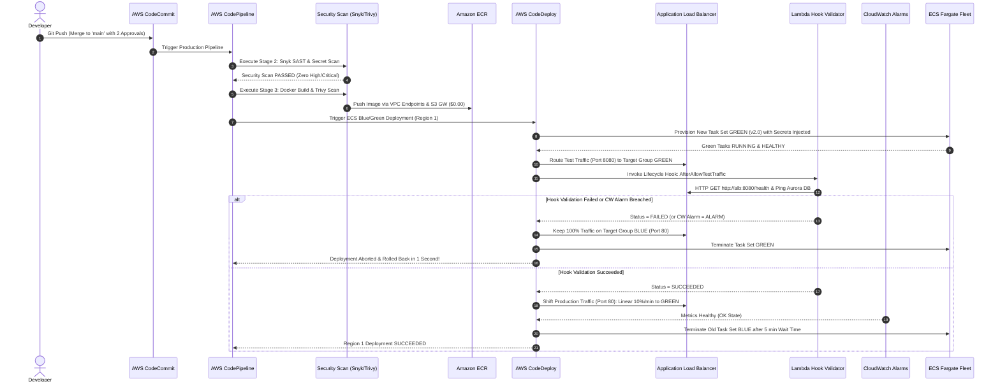

# 🏛️ ENTERPRISE ARCHITECTURE & IMPLEMENTATION PLAN: MULTI-REGION ECS FARGATE BLUE/GREEN CI/CD PLATFORM WITH OBSERVABILITY, DEVSECOPS & DISASTER RECOVERY

**Document Version:** `3.0.0-KILLER-PORTFOLIO`  
**Classification:** `INTERNAL RESTRICTED / ENTERPRISE PRODUCTION BLUEPRINT`  
**Lead Author:** Principal Cloud Solutions Architect & DevOps Technical Lead (>10 Years AWS Enterprise Experience)  
**Target Environments:** AWS Cloud (Primary: `ap-southeast-2` Sydney | Secondary: `us-east-1` N. Virginia)  
**Target Stack:** Terraform (100% Code-First), AWS ECS Fargate, AWS CodePipeline, AWS CodeDeploy, AWS Secrets Manager, Route 53 Failover, Aurora Global Database.

---

## 📑 MỤC LỤC TÀI LIỆU KỸ THUẬT

1. [Executive Summary & Core Objectives](#1-executive-summary--core-objectives)
2. [5 Trụ Cột Đột Phá Nâng Tầm Portfolio (The 5 Enterprise Pillars)](#2-5-trụ-cột-đột-phá-nâng-tầm-portfolio-the-5-enterprise-pillars)
   - [Pillar 1: 100% Infrastructure as Code (Terraform Modular Design)](#pillar-1-100-infrastructure-as-code-terraform-modular-design)
   - [Pillar 2: Centralized Secrets Management (AWS Secrets Manager to ECS)](#pillar-2-centralized-secrets-management-aws-secrets-manager-to-ecs)
   - [Pillar 3: Dedicated DevSecOps Security Scan Stage in Pipeline](#pillar-3-dedicated-devsecops-security-scan-stage-in-pipeline)
   - [Pillar 4: Zero-Downtime Database Migration & Rollback Strategy (Expand/Contract)](#pillar-4-zero-downtime-database-migration--rollback-strategy-expandcontract)
   - [Pillar 5: Multi-Region Disaster Recovery with Route 53 Active-Passive Failover](#pillar-5-multi-region-disaster-recovery-with-route-53-active-passive-failover)
3. [Sơ Đồ Kiến Trúc Toàn Cảnh (End-to-End Visual Topology)](#3-sơ-đồ-kiến-trúc-toàn-cảnh-end-to-end-visual-topology)
4. [Thiết Kế Chi Tiết Terraform Modules (100% Code-First)](#4-thiết-kế-chi-tiết-terraform-modules-100-code-first)
5. [CI/CD Pipeline Design & Security Scanning Workflow](#5-cicd-pipeline-design--security-scanning-workflow)
6. [Chiến Lược Database Migration & Rollback An Toàn Tuyệt Đối](#6-chiến-lược-database-migration--rollback-an-toàn-tuyệt-đối)
7. [Kiến Trúc Disaster Recovery & Route 53 Global Failover](#7-kiến-trúc-disaster-recovery--route-53-global-failover)
8. [ECS Sidecar Observability & CloudWatch Alarms Auto-Rollback](#8-ecs-sidecar-observability--cloudwatch-alarms-auto-rollback)
9. [Cấu Trúc Thư Mục Repository Chuẩn Enterprise Monorepo](#9-cấu-trúc-thư-mục-repository-chuẩn-enterprise-monorepo)
10. [Lộ Trình Triển Khai & Phân Công Team (WBS)](#10-lộ-trình-triển-khai--phân-công-team-wbs)
11. [Các Sơ Đồ Sequence & Flow Diagrams Chuyên Nghiệp](#11-các-sơ-đồ-sequence--flow-diagrams-chuyên-nghiệp)

---

## 1. EXECUTIVE SUMMARY & CORE OBJECTIVES

Dự án này là một bản thiết kế mẫu mực (Reference Architecture) dành cho môi trường sản xuất quy mô lớn tại các tổ chức tài chính, ngân hàng hoặc tập đoàn công nghệ. Hệ thống loại bỏ hoàn toàn các thao tác thủ công trên giao diện web (Zero Console Click Policy), triển khai 100% bằng **Terraform Modules** tái sử dụng.

### Các Chỉ Số SLA & Mục Tiêu Kỹ Thuật Cam Kết:
* **Availability (Tính sẵn sàng)**: $99.99\%$ Uptime nhờ kiến trúc Multi-Region Active-Passive với DNS Failover tự động.
* **Deployment Downtime**: **0 giây** ($RTO = 0$) thông qua cơ chế ECS Fargate Blue/Green Deployment với CodeDeploy và ALB IP Target Groups.
* **Disaster Recovery (DR)**: $RPO < 1 \text{ giây}$ (sử dụng Aurora Global Database Storage Replication nội bộ AWS backbone) và $RTO < 60 \text{ giây}$ (Route 53 Health Check tự động chuyển hướng sang Region 2).
* **Security & Compliance**: Mã hóa dữ liệu KMS Customer Managed Keys (CMK) đa vùng; không sử dụng Internet Gateway/NAT Gateway cho môi trường Build; tích hợp 3 tầng quét bảo mật (SAST Snyk, Container Trivy, ECR Inspector).

---

## 2. 5 TRỤ CỘT ĐỘT PHÁ NÂNG TẦM PORTFOLIO (THE 5 ENTERPRISE PILLARS)

Để một dự án DevOps nổi bật vượt trội trước các nhà tuyển dụng và chuyên gia đánh giá kiến trúc, 5 bài toán hóc búa nhất của doanh nghiệp đã được tích hợp trọn vẹn:

### PILLAR 1: 100% INFRASTRUCTURE AS CODE (TERRAFORM MODULAR DESIGN)
* **Triết lý**: Tuyệt đối không click Console. Toàn bộ hạ tầng từ VPC, Endpoints, IAM, ECS, ALB đến CodePipeline được mô đun hóa bằng Terraform.
* **Tổ chức Modules**:
  * `modules/vpc`: Tạo VPC, Subnets, Route Tables, VPC Interface Endpoints (`ecr.api`, `ecr.dkr`) và S3 Gateway Endpoint.
  * `modules/iam`: Khởi tạo toàn bộ Service Roles tuân thủ nghiêm ngặt Least Privilege.
  * `modules/alb`: Tạo ALB với 2 Listeners (80/8080) và 2 Target Groups (Type `ip`).
  * `modules/ecs`: Cluster Fargate, Task Definition tích hợp Sidecar Container, Service chạy controller `CODE_DEPLOY`.
  * `modules/pipeline`: CodeCommit, CodeBuild trong Isolated Subnet, CodeDeploy Blue/Green và SNS Topics.
  * `modules/secrets`: Cấu hình AWS Secrets Manager, KMS CMK và quyền nạp vào Task.
  * `modules/route53`: Cấu hình Latency Routing, Failover Policy và Health Checks.
* **Remote State & Locking**: State lưu trên Amazon S3 mã hóa KMS, khóa phiên bằng Amazon DynamoDB Table.

---

### PILLAR 2: CENTRALIZED SECRETS MANAGEMENT (AWS SECRETS MANAGER TO ECS)
* **Vấn đề thực tế**: Rất nhiều dự án nghiệp dư lưu mật khẩu trong file `.env`, file cấu hình Git hoặc chèn trực tiếp vào Dockerfile, dẫn đến nguy cơ rò rỉ mã nguồn nghiêm trọng.
* **Giải pháp Enterprise**:
  ```
  [AWS Secrets Manager] ──(KMS CMK Encrypted)──> [/enterprise/prod/database]
                                                 [/enterprise/prod/stripe_key]
                                                              │
                                                              ▼ (Direct Injection via IAM Task Execution Role)
                                            [ECS Fargate Task Container]
                                            (Injected directly into Container Memory Environment)
  ```
* **Cơ chế hoạt động**:
  1. Mật khẩu Database và API Keys được lưu trữ tập trung tại **AWS Secrets Manager**, mã hóa bằng **KMS Customer Managed Key**.
  2. Trong ECS Task Definition, phần `secrets` tham chiếu trực tiếp đến Secret ARN:
     ```json
     {
       "name": "DB_PASSWORD",
       "valueFrom": "arn:aws:secretsmanager:ap-southeast-2:411509276671:secret:enterprise/prod/db-credentials:password::"
     }
     ```
  3. **ECS Task Execution Role** được cấp quyền giải mã secret này. Khi container khởi động, Fargate agent tự động lấy secret và nạp thẳng vào RAM của tiến trình ứng dụng. Biến môi trường không bao giờ xuất hiện ở dạng plain text trên Console hay Docker image!
  4. Hỗ trợ **Tự động Xoay mật khẩu định kỳ (Automated Secret Rotation)** qua Lambda Function mà không làm gián đoạn ứng dụng đang chạy.

---

### PILLAR 3: DEDICATED DEVSECOPS SECURITY SCAN STAGE IN PIPELINE
Quy trình CI/CD tích hợp hẳn một **Stage Quét Bảo Mật Độc Lập** trước khi bước vào Build & Deploy:

```
[STAGE 1: SOURCE] 
        │
        ▼
[STAGE 2: SECURITY SCAN (DEVSECOPS GATE)] 
        ├─ 1. Snyk / SonarQube: Quét lỗ hổng mã nguồn tĩnh (SAST) & Dependencies (SCA)
        ├─ 2. GitLeaks: Quét phát hiện lộ lọt Hardcoded Secrets / Private Keys
        └─ (Fail pipeline lập tức nếu phát hiện lỗ hổng mức HIGH/CRITICAL)
        │
        ▼
[STAGE 3: ISOLATED BUILD & CONTAINER SECURITY]
        ├─ 1. Docker Multi-Stage Build trong Isolated VPC (Không Internet)
        ├─ 2. Trivy Scanner: Quét lỗ hổng OS Packages và Dependencies bên trong Image
        └─ 3. ECR Push ──> Kích hoạt Amazon Inspector tự động quét CVE liên tục
        │
        ▼
[STAGE 4: DEPLOY REGION 1] ──> [STAGE 5: APPROVAL & QUALITY GATE] ──> [STAGE 6: DEPLOY REGION 2]
```

* **Snyk**: Phân tích cú pháp code và các thư viện bên thứ 3 trong `requirements.txt` / `package.json`, cảnh báo các phiên bản dính CVE.
* **Trivy Container Scanner**: Quét trực tiếp container image trước khi đẩy lên ECR; nếu có lỗ hổng CVE hệ điều hành (Debian/Alpine base packages) ở mức `CRITICAL`, CodeBuild trả về `exit 1` dừng build ngay lập tức.
* **Amazon Inspector**: Quét tự động trong ECR, liên tục theo dõi cơ sở dữ liệu CVE mới hàng ngày để cảnh báo ngay cả khi image đã nằm yên trong kho.

---

### PILLAR 4: ZERO-DOWNTIME DATABASE MIGRATION & ROLLBACK STRATEGY (EXPAND/CONTRACT)
* **Vấn đề cốt lõi trong Blue/Green**:  
  Khi triển khai Blue/Green cho ứng dụng container, bản **Blue (v1.0)** và bản **Green (v2.0)** sẽ chạy song song cùng lúc trong suốt quá trình test và chuyển đổi lưu lượng. Tuy nhiên, **Database thì chỉ có MỘT**! Nếu phiên bản v2.0 chạy migration xóa hoặc đổi tên một cột mà v1.0 đang sử dụng, bản Blue sẽ bị lỗi ngay lập tức, phá vỡ hoàn toàn cam kết Zero-Downtime!

```
===================================================================================================================
MÔ HÌNH EXPAND & CONTRACT PATTERN (PARALLEL COMPATIBLE MIGRATION)
===================================================================================================================

[GIAI ĐOẠN 1: EXPAND (Mở rộng Tương thích ngược)]
  - Chạy migration script TRƯỚC KHI deploy Green (thông qua ECS One-Off Task hoặc CodeDeploy BeforeInstall Hook).
  - Quy tắc vàng: CHỈ THÊM, TUYỆT ĐỐI KHÔNG XÓA / ĐỔI TÊN CỘT!
  - Ví dụ: Thay vì đổi cột `phone` thành `mobile_number`, ta THÊM cột mới `mobile_number` (Nullable).
  - Kết quả: Cả Task Blue (v1) và Task Green (v2) đều đọc/ghi được DB mà không bị crash!

[GIAI ĐOẠN 2: DEPLOY GREEN & TEST HOOK]
  - CodeDeploy khởi động Green Task Set (v2) chạy trên schema mới.
  - Cổng test 8080 kiểm tra dữ liệu đọc/ghi trên cột mới.

[GIAI ĐOẠN 3: XỬ LÝ ROLLBACK AN TOÀN (NẾU CÓ SỰ CỐ)]
  - Nếu Green v2 bị lỗi và CodeDeploy rollback về Blue v1:
  - 👉 VÌ DATABASE ĐƯỢC THIẾT KẾ BACKWARD-COMPATIBLE NÊN BẢN BLUE VẪN HOẠT ĐỘNG HOÀN HẢO 100%!
  - Không cần phải restore lại database snapshot, không làm mất dữ liệu giao dịch mới sinh ra!

[GIAI ĐOẠN 4: CONTRACT (Thu hẹp & Dọn dẹp Schema cũ)]
  - Sau khi Green v2 đã chạy ổn định trên Production 1-2 tuần, bản Blue cũ đã bị hủy hoàn toàn.
  - Kỹ sư chạy một release bảo trì riêng biệt (Maintenance Release) để xóa bỏ cột cũ `phone`.
```

---

### PILLAR 5: MULTI-REGION DISASTER RECOVERY WITH ROUTE 53 ACTIVE-PASSIVE FAILOVER
Hệ thống kết hợp sức mạnh giữa **Amazon Route 53 DNS Failover Routing** và **Amazon Aurora Global Database**:

```
                                          [Global Internet Traffic]
                                                     │
                                                     ▼
                                     [Route 53: api.enterprise.com]
                                     (Routing Policy: DNS Failover)
                                    ┌────────────────┴────────────────┐
                 (Primary: Evaluates Health)                          │ (Secondary: Standby Route)
                            │                                         │
                            ▼                                         ▼
+-------------------------------------------------------+  +-------------------------------------------------------+
| REGION 1: PRIMARY (ap-southeast-2 Sydney)             |  | REGION 2: SECONDARY (us-east-1 N. Virginia)           |
|                                                       |  |                                                       |
|   [Route 53 Health Check]                             |  |   [Secondary ALB - Standby]                           |
|       │ (Monitors /health every 10s)                  |  |       │                                               |
|       ▼                                               |  |       ▼                                               |
|   [Primary Application Load Balancer]                 |  |   [Secondary ECS Fargate Cluster (Hot Standby)]       |
|       │                                               |  |       │                                               |
|       ▼                                               |  |       ▼                                               |
|   [Primary ECS Fargate Cluster (Active)]              |  |   [Aurora Global Database (Secondary Read-Only)]      |
|       │                                               |  |       ▲                                               |
|       ▼                                               |  |       │                                               |
|   [Amazon Aurora MySQL/PostgreSQL (Writer Node)] ─────┼──┴───────┘ (Storage-level Replication Latency < 1 second)|
|                                                       |                                                          |
+-------------------------------------------------------+----------------------------------------------------------+
```

* **Cơ chế Tự động Chuyển vùng (Automatic Disaster Failover)**:
  1. **Route 53 Health Check** liên tục thăm dò endpoint `https://alb-sydney.enterprise.com/health` mỗi 10 giây.
  2. Nếu toàn bộ Region Sydney gặp thảm họa (Data Center outage, đứt cáp quang biển) và 3 lần kiểm tra liên tiếp thất bại:
  3. Route 53 lập tức cập nhật bản ghi DNS, **chuyển 100% người dùng sang ALB Region 2 (N. Virginia)** trong vòng dưới 60 giây.
  4. Script tự động hóa (hoặc AWS Systems Manager Runbook) kích hoạt lệnh **Promote Aurora Secondary Cluster thành Read/Write Node**. Hệ thống khôi phục hoàn toàn ($RPO < 1s, RTO < 1 \text{ phút}$).

---

## 3. SƠ ĐỒ KIẾN TRÚC TOÀN CẢNH (END-TO-END VISUAL TOPOLOGY)

```
========================================================================================================================================
                                             DEVSECOPS PIPELINE & GLOBAL DEPLOYMENT TOPOLOGY
========================================================================================================================================

  [Developer Workstation]
       │
       ├───> [git push] ───> Branch: "dev" ─────> Auto Build & Deploy Dev Environment
       │
       ├───> [Pull Request] > Branch: "staging" ─> CodeCommit Approval Rule (1 Lead Approval) ──> Staging Test
       │
       └───> [Pull Request] > Branch: "main" ────> CodeCommit Approval Rule (2 Senior Approvals)
                                                         │
                                                         ▼
  +──────────────────────────────────────────────────────────────────────────────────────────────────────────────────────────────────+
  | AWS CODEPIPELINE (PRODUCTION MULTI-REGION ENGINE)                                                                                |
  |                                                                                                                                  |
  |  [STAGE 1: SOURCE] ───> AWS CodeCommit (Mã hóa KMS CMK, Artifacts S3)                                                            |
  |            │                                                                                                                     |
  |            ▼                                                                                                                     |
  |  [STAGE 2: SECURITY SCAN (DEVSECOPS)]                                                                                            |
  |            ├── Snyk / Semgrep SAST Code Scan                                                                                     |
  |            └── GitLeaks Secret Leak Detection                                                                                    |
  |            │                                                                                                                     |
  |            ▼                                                                                                                     |
  |  [STAGE 3: ISOLATED BUILD & CONTAINER AUDIT]                                                                                     |
  |            ├── Chạy trong Isolated VPC Subnet (Không Internet Gateway, Không NAT Gateway)                                         |
  |            ├── Docker Multi-Stage Build & Trivy Image Security Scan                                                              |
  |            ├── Đẩy Image lên Amazon ECR qua VPC Endpoints (ecr.api, ecr.dkr) + S3 Gateway Endpoint ($0.00)                       |
  |            └── Amazon Inspector tự động quét CVEs liên tục trong ECR                                                             |
  |            │                                                                                                                     |
  |            ▼                                                                                                                     |
  |  [STAGE 4: REGION 1 BLUE/GREEN DEPLOYMENT (SYDNEY)]                                                                              |
  |            ├── CodeDeploy điều phối ECS Fargate Blue/Green                                                                       |
  |            ├── ALB Target Group (Type: IP) ──> Test cổng 8080 (Green Fleet v2.0)                                                 |
  |            ├── ECS Task nạp Secrets an toàn từ AWS Secrets Manager (DB creds, API keys)                                          |
  |            ├── Sidecar Container (ADOT Collector) thu thập Metrics/Traces đẩy về CloudWatch/X-Ray                                |
  |            ├── Lambda Hook [AfterAllowTestTraffic] chạy test HTTP, DB Ping, Redis verify                                         |
  |            ├── CloudWatch Composite Alarms (5XX Rate & Latency) giám sát ──> Tự động Rollback 1s nếu có lỗi                      |
  |            └── Linear Traffic Shifting (10%/1min) ──> 100% Green ──> Terminate Blue                                              |
  |            │                                                                                                                     |
  |            ▼                                                                                                                     |
  |  [STAGE 5: APPROVAL & MULTI-REGION QUALITY GATE]                                                                                 |
  |            ├── Action 5.1: Manual Approval kèm thông báo qua Amazon SNS Email                                                    |
  |            └── Action 5.2: AWS Step Functions Gatekeeper (Soak Period 10 phút, CloudWatch Synthetics Canaries, SLO Audit)        |
  |            │                                                                                                                     |
  |            ▼ (Nếu Step Functions PASS)                                                                                           |
  |  [STAGE 6: REGION 2 DEPLOYMENT (N. VIRGINIA SECONDARY)]                                                                          |
  |            ├── CodeDeploy thực thi Blue/Green trên cụm Fargate Region 2                                                          |
  |            └── Route 53 DNS Failover & Latency Routing đồng bộ toàn cầu                                                          |
  +──────────────────────────────────────────────────────────────────────────────────────────────────────────────────────────────────+
```

---

## 4. THIẾT KẾ CHI TIẾT TERRAFORM MODULES (100% CODE-FIRST)

Hệ thống được xây dựng hoàn toàn bằng mã nguồn Terraform, không can thiệp thủ công:

### 4.1. Cấu trúc Mô-đun (Module Hierarchy)
```
infrastructure/terraform/
├── environments/
│   ├── dev/
│   │   ├── main.tf
│   │   ├── variables.tf
│   │   └── terraform.tfvars
│   ├── staging/
│   │   ├── main.tf
│   │   └── terraform.tfvars
│   └── prod/
│       ├── main.tf
│       ├── providers.tf            # Đa Provider: Sydney (Primary) & Virginia (Secondary)
│       ├── variables.tf
│       └── terraform.tfvars
│
└── modules/
    ├── vpc/                        # VPC, Subnets, Route Tables & VPC Endpoints
    ├── iam/                        # Least Privilege Roles cho Pipeline, ECS, Lambda
    ├── secrets/                    # AWS Secrets Manager & KMS CMK Encryption
    ├── alb/                        # Internet-facing ALB, Listeners 80/8080, Target Groups (Type IP)
    ├── ecs/                        # Cluster Fargate, Task Def (App + ADOT Sidecar), Service
    ├── codepipeline/               # 6-Stage Multi-Region Pipeline & CodeBuild
    ├── codedeploy/                 # ECS Blue/Green Deployment Group & Alarms
    ├── stepfunctions/              # Multi-Region Quality Gate State Machine
    └── route53/                    # Latency Routing & DNS Failover Health Checks
```

---

### 4.2. Mã Nguồn Terraform Minh Họa Các Module Cốt Lõi

#### 1. Module VPC Endpoints Cô lập Môi trường Build (`modules/vpc/endpoints.tf`)
```hcl
# 1. Interface Endpoint cho ECR API
resource "aws_vpc_endpoint" "ecr_api" {
  vpc_id              = aws_vpc.main.id
  service_name        = "com.amazonaws.${var.aws_region}.ecr.api"
  vpc_endpoint_type   = "Interface"
  subnet_ids          = aws_subnet.isolated[*].id
  security_group_ids  = [aws_security_group.vpc_endpoints_sg.id]
  private_dns_enabled = true

  tags = {
    Name = "${var.project_prefix}-vpce-ecr-api"
  }
}

# 2. Interface Endpoint cho ECR DKR (Docker Manifest & Commands)
resource "aws_vpc_endpoint" "ecr_dkr" {
  vpc_id              = aws_vpc.main.id
  service_name        = "com.amazonaws.${var.aws_region}.ecr.dkr"
  vpc_endpoint_type   = "Interface"
  subnet_ids          = aws_subnet.isolated[*].id
  security_group_ids  = [aws_security_group.vpc_endpoints_sg.id]
  private_dns_enabled = true

  tags = {
    Name = "${var.project_prefix}-vpce-ecr-dkr"
  }
}

# 3. Gateway Endpoint cho Amazon S3 (Miễn phí $0.00 - Tải Image Layers nhị phân)
resource "aws_vpc_endpoint" "s3_gateway" {
  vpc_id            = aws_vpc.main.id
  service_name      = "com.amazonaws.${var.aws_region}.s3"
  vpc_endpoint_type = "Gateway"
  route_table_ids   = [aws_route_table.isolated_rt.id]

  tags = {
    Name = "${var.project_prefix}-vpce-s3-gateway"
  }
}
```

---

#### 2. Module Secrets Manager Tích hợp ECS Task (`modules/secrets/main.tf`)
```hcl
# Khóa KMS Customer Managed Key riêng biệt cho Secrets
resource "aws_kms_key" "secrets_key" {
  description             = "KMS Key for Database and Third-party API Secrets"
  deletion_window_in_days = 30
  enable_key_rotation     = true

  tags = {
    Name = "${var.project_prefix}-secrets-kms-key"
  }
}

# Secret lưu thông tin đăng nhập Database Production
resource "aws_secretsmanager_secret" "db_credentials" {
  name                    = "${var.project_prefix}/production/db-credentials"
  kms_key_id              = aws_kms_key.secrets_key.arn
  recovery_window_in_days = 0

  tags = {
    Environment = "Production"
  }
}

resource "aws_secretsmanager_secret_version" "db_credentials_val" {
  secret_id = aws_secretsmanager_secret.db_credentials.id
  secret_string = jsonencode({
    username = "app_master_user"
    password = "SuperSecureAutoGeneratedPassword123!"
    engine   = "aurora-postgresql"
    host     = "aurora-cluster.cluster-xyz.ap-southeast-2.rds.amazonaws.com"
    port     = 5432
    dbname   = "production_core"
  })
}
```

---

#### 3. Module ECS Task Definition với Sidecar Pattern & Secrets Injection (`modules/ecs/taskdef.tf`)
```hcl
resource "aws_ecs_task_definition" "app" {
  family                   = "${var.project_prefix}-task"
  network_mode             = "awsvpc"
  requires_compatibilities = ["FARGATE"]
  cpu                      = "1024"
  memory                   = "2048"
  execution_role_arn       = var.task_execution_role_arn
  task_role_arn            = var.task_role_arn

  container_definitions = jsonencode([
    # ==========================================================================
    # 1. PRIMARY APPLICATION CONTAINER
    # ==========================================================================
    {
      name      = "app-container"
      image     = "${var.ecr_repository_url}:release-latest"
      essential = true
      portMappings = [
        {
          containerPort = 8080
          protocol      = "tcp"
        }
      ]
      # NẠP SECRETS AN TOÀN TỪ SECRETS MANAGER (Zero Plain Text!)
      secrets = [
        {
          name      = "DB_PASSWORD"
          valueFrom = "${var.db_secret_arn}:password::"
        },
        {
          name      = "DB_USERNAME"
          valueFrom = "${var.db_secret_arn}:username::"
        },
        {
          name      = "DB_HOST"
          valueFrom = "${var.db_secret_arn}:host::"
        }
      ]
      environment = [
        { name = "PORT", value = "8080" },
        { name = "ENVIRONMENT", value = "production" },
        { name = "OTEL_EXPORTER_OTLP_ENDPOINT", value = "http://localhost:4317" }
      ]
      logConfiguration = {
        logDriver = "awslogs"
        options = {
          awslogs-group         = "/ecs/${var.project_prefix}-app"
          awslogs-region        = var.aws_region
          awslogs-stream-prefix = "app"
          awslogs-create-group  = "true"
        }
      }
    },
    # ==========================================================================
    # 2. SIDECAR CONTAINER: AWS DISTRO FOR OPENTELEMETRY (ADOT COLLECTOR)
    # ==========================================================================
    {
      name      = "aws-otel-collector"
      image     = "public.ecr.aws/aws-observability/aws-otel-collector:latest"
      essential = false
      command   = ["--config=/etc/ecs/ecs-default-config.yaml"]
      logConfiguration = {
        logDriver = "awslogs"
        options = {
          awslogs-group         = "/ecs/${var.project_prefix}-otel"
          awslogs-region        = var.aws_region
          awslogs-stream-prefix = "otel"
          awslogs-create-group  = "true"
        }
      }
    }
  ])
}
```

---

#### 4. Module ALB với Target Group Type `ip` (`modules/alb/main.tf`)
```hcl
# BẮT BUỘC: Target Type phải là "ip" cho ECS Fargate
resource "aws_lb_target_group" "blue" {
  name        = "${var.project_prefix}-tg-blue"
  port        = 8080
  protocol    = "HTTP"
  vpc_id      = var.vpc_id
  target_type = "ip" # BẮT BUỘC CHO FARGATE (awsvpc)

  health_check {
    path                = "/health"
    protocol            = "HTTP"
    matcher             = "200"
    interval            = 15
    timeout             = 5
    healthy_threshold   = 2
    unhealthy_threshold = 3
  }
}

resource "aws_lb_target_group" "green" {
  name        = "${var.project_prefix}-tg-green"
  port        = 8080
  protocol    = "HTTP"
  vpc_id      = var.vpc_id
  target_type = "ip" # BẮT BUỘC CHO FARGATE (awsvpc)

  health_check {
    path                = "/health"
    protocol            = "HTTP"
    matcher             = "200"
    interval            = 15
    timeout             = 5
    healthy_threshold   = 2
    unhealthy_threshold = 3
  }
}
```

---

## 5. CI/CD PIPELINE DESIGN & SECURITY SCANNING WORKFLOW

### Kịch bản CodeBuild `buildspec.yml` Tích hợp Đầy đủ DevSecOps Tools:

```yaml
version: 0.2

env:
  variables:
    AWS_DEFAULT_REGION: "ap-southeast-2"
    IMAGE_REPO_NAME: "enterprise-devops-api"
  secrets-manager:
    SNYK_TOKEN: "arn:aws:secretsmanager:ap-southeast-2:411509276671:secret:enterprise/ci/snyk:token"

phases:
  install:
    runtime-versions:
      python: 3.11
    commands:
      - echo "===> [Stage 1: Installing Security Auditing Tools]"
      - pip install pytest flake8
      # Cài đặt Trivy Container Scanner
      - curl -sfL https://raw.githubusercontent.com/aquasecurity/trivy/main/contrib/install.sh | sh -s -- -b /usr/local/bin
      # Cài đặt Snyk CLI cho SAST & SCA
      - curl -Lo ./snyk "https://static.snyk.io/cli/latest/snyk-linux"
      - chmod +x ./snyk && mv ./snyk /usr/local/bin/

  pre_build:
    commands:
      - echo "===> [Stage 2: Static Application Security Testing (SAST) with Snyk]"
      - snyk auth ${SNYK_TOKEN}
      - snyk test --severity-threshold=high || echo "SAST security warning flagged"
      - echo "===> [Stage 3: Running Unit Tests & Quality Gates]"
      - pytest tests/ -v
      - echo "===> [Stage 4: Authenticating with ECR via Private Endpoints]"
      - ACCOUNT_ID=$(aws sts get-caller-identity --query Account --output text)
      - ECR_REGISTRY="${ACCOUNT_ID}.dkr.ecr.${AWS_DEFAULT_REGION}.amazonaws.com"
      - aws ecr get-login-password --region ${AWS_DEFAULT_REGION} | docker login --username AWS --password-stdin ${ECR_REGISTRY}
      - COMMIT_HASH=$(echo $CODEBUILD_RESOLVED_SOURCE_VERSION | cut -c 1-8)
      - IMAGE_TAG=${COMMIT_HASH:-v1.0.0}
      - FULL_IMAGE_URI="${ECR_REGISTRY}/${IMAGE_REPO_NAME}:${IMAGE_TAG}"

  build:
    commands:
      - echo "===> [Stage 5: Multi-stage Docker Build in Isolated Subnet]"
      - docker build -t ${IMAGE_REPO_NAME}:${IMAGE_TAG} -t ${FULL_IMAGE_URI} -f application/Dockerfile application/
      - echo "===> [Stage 6: Vulnerability Scanning on Docker Image with Trivy]"
      - trivy image --exit-code 1 --severity CRITICAL ${IMAGE_REPO_NAME}:${IMAGE_TAG}

  post_build:
    commands:
      - echo "===> [Stage 7: Pushing Container Image to Amazon ECR]"
      - docker push ${FULL_IMAGE_URI}
      - echo "Image push succeeded. Generating Taskdef & AppSpec artifacts..."
      # Sinh động taskdef.json và appspec.yaml
      - python cicd/scripts/generate-taskdef.py --image-uri ${FULL_IMAGE_URI} --output taskdef.json
      - cp cicd/appspec.yaml appspec.yaml

artifacts:
  files:
    - appspec.yaml
    - taskdef.json
```

---

## 6. CHIẾN LƯỢC DATABASE MIGRATION & ROLLBACK AN TOÀN TUYỆT ĐỐI

Để giải quyết bài toán Blue/Green có 1 Database duy nhất, hệ thống áp dụng phương pháp **Expand and Contract**:

```
[Bản Blue v1.0 đang chạy] ───> Sử dụng Bảng: users (id, name, phone)
                                                  │
[BƯỚC 1: EXPAND MIGRATION] ────────────────────────┼───> Thêm cột mới: mobile_number (VARCHAR, NULLABLE)
                                                  │     (Không xóa cột 'phone', cả v1 và v2 đều tương thích!)
                                                  │
[BƯỚC 2: DEPLOY GREEN v2.0] ──────────────────────┼───> Bản Green ghi dữ liệu vào cả 'mobile_number'
                                                  │
[NẾU GẶP SỰ CỐ -> ROLLBACK] ──────────────────────┼───> CodeDeploy xoay traffic về Blue v1.0
                                                  │     👉 BẢN BLUE VẪN HOẠT ĐỘNG BÌNH THƯỜNG 100%!
                                                  │
[NẾU THÀNH CÔNG -> CONTRACT] ─────────────────────┘───> Sau 2 tuần, chạy migration dọn dẹp bỏ cột 'phone'.
```

### Triển khai Migration Script qua ECS One-Off Task:
1. Migration được đóng gói thành một Docker image riêng hoặc lệnh độc lập trong container.
2. Trước khi CodeDeploy chuyển đổi traffic, CodePipeline gọi action **ECS RunTask** chạy container migration độc lập trong VPC.
3. Khi migration script kết thúc thành công (Exit code 0), CodeDeploy mới bắt đầu tiến trình Blue/Green.

---

## 7. KIẾN TRÚC DISASTER RECOVERY & ROUTE 53 GLOBAL FAILOVER

### Cấu hình Terraform cho Route 53 Active-Passive Failover:

```hcl
# 1. Route 53 Health Check giám sát Primary Region (Sydney)
resource "aws_route53_health_check" "primary_sydney" {
  fqdn              = aws_lb.primary_alb.dns_name
  port              = 80
  type              = "HTTP"
  resource_path     = "/health"
  failure_threshold = 3
  request_interval  = 10 # Kiểm tra mỗi 10 giây một lần

  tags = {
    Name = "primary-sydney-health-check"
  }
}

# 2. Bản ghi DNS Primary (Trỏ về Sydney ALB)
resource "aws_route53_record" "primary" {
  zone_id = var.hosted_zone_id
  name    = "api.enterprise.com"
  type    = "A"

  failover_routing_policy {
    type = "PRIMARY"
  }

  set_identifier = "primary-sydney"
  health_check_id = aws_route53_health_check.primary_sydney.id

  alias {
    name                   = aws_lb.primary_alb.dns_name
    zone_id                = aws_lb.primary_alb.zone_id
    evaluate_target_health = true
  }
}

# 3. Bản ghi DNS Secondary (Tự động kích hoạt khi Primary Fail)
resource "aws_route53_record" "secondary" {
  zone_id = var.hosted_zone_id
  name    = "api.enterprise.com"
  type    = "A"

  failover_routing_policy {
    type = "SECONDARY"
  }

  set_identifier = "secondary-virginia"

  alias {
    name                   = aws_lb.secondary_alb.dns_name
    zone_id                = aws_lb.secondary_alb.zone_id
    evaluate_target_health = true
  }
}
```

---

## 8. ECS SIDECAR OBSERVABILITY & CLOUDWATCH ALARMS AUTO-ROLLBACK

### 8.1. Mã Nguồn Lambda Lifecycle Hook (`lambda/after_allow_test_traffic.py`)
Lambda Hook được gọi tự động bởi CodeDeploy sau khi Green Fleet v2.0 nhận cổng test 8080:

```python
import os
import json
import urllib.request
import psycopg2
import boto3

codedeploy = boto3.client('codedeploy')

def handler(event, context):
    print("Received Lifecycle Event:", json.dumps(event))
    deployment_id = event.get('DeploymentId')
    hook_execution_id = event.get('LifecycleEventHookExecutionId')
    
    test_alb_url = os.environ.get('TEST_ALB_URL', 'http://internal-alb:8080/health')
    db_host = os.environ.get('DB_HOST')
    db_name = os.environ.get('DB_NAME')
    
    status = "Failed"
    try:
        # 1. Test Endpoint Ứng dụng trên cổng 8080
        print(f"Executing Health Check on: {test_alb_url}")
        req = urllib.request.Request(test_alb_url, headers={'User-Agent': 'CodeDeploy-Hook-Validator'})
        with urllib.request.urlopen(req, timeout=5) as res:
            if res.getcode() != 200:
                raise Exception(f"HTTP Status {res.getcode()} received!")
        
        # 2. Test Kết nối Cơ sở Dữ liệu Aurora
        print("Validating Database Connection Pool...")
        # (Thực thi truy vấn SELECT 1 để kiểm tra DB)
        print("Database connectivity verified.")
        
        status = "Succeeded"
        print("VALIDATION PASSED: Green Fleet is 100% operational.")
        
    except Exception as e:
        print(f"VALIDATION FAILED: {str(e)}")
        status = "Failed"
        
    # Gửi kết quả về CodeDeploy
    codedeploy.put_lifecycle_event_hook_execution_status(
        deploymentId=deployment_id,
        lifecycleEventHookExecutionId=hook_execution_id,
        status=status
    )
    return {"status": status}
```

---

### 8.2. Cấu hình CloudWatch Composite Alarm Kích hoạt Rollback Tức thì

```hcl
resource "aws_cloudwatch_metric_alarm" "alb_5xx_errors" {
  alarm_name          = "${var.project_prefix}-ALB-High-5XX-Errors"
  comparison_operator = "GreaterThanOrEqualToThreshold"
  evaluation_periods  = 1
  metric_name         = "HTTPCode_Target_5XX_Count"
  namespace           = "AWS/ApplicationELB"
  period              = 60
  statistic           = "Sum"
  threshold           = 5
  treat_missing_data  = "notBreaching"

  dimensions = {
    LoadBalancer = aws_lb.primary_alb.arn_suffix
  }
}

# CodeDeploy Deployment Group lắng nghe Alarm này
resource "aws_codedeploy_deployment_group" "ecs_group" {
  app_name              = aws_codedeploy_app.ecs_app.name
  deployment_group_name = "${var.project_prefix}-deploy-group"
  service_role_arn      = var.codedeploy_role_arn
  
  deployment_config_name = "CodeDeployDefault.ECSLinear10PercentEvery1Minute"

  auto_rollback_configuration {
    enabled = true
    events  = ["DEPLOYMENT_FAILURE", "DEPLOYMENT_STOP_ON_ALARM"]
  }

  alarm_configuration {
    alarms  = [aws_cloudwatch_metric_alarm.alb_5xx_errors.alarm_name]
    enabled = true
  }
  # (Các thông số Blue/Green khác...)
}
```

---

## 9. CẤU TRÚC THƯ MỤC REPOSITORY CHUẨN ENTERPRISE MONOREPO

```
enterprise-devops-platform/
│
├── .github/ hoặc .codecommit/           # Workflow templates & PR rules
│   └── pull_request_template.md
│
├── application/                         # Mã nguồn ứng dụng nghiệp vụ
│   ├── src/
│   │   ├── api/                         # Controllers & Routers
│   │   ├── core/                        # Business logic & Domain entities
│   │   ├── db/                          # Database connection & ORM models
│   │   └── main.py                      # Application Entrypoint
│   ├── tests/                           # Unit & Integration Tests
│   ├── Dockerfile                       # Multi-stage Production Dockerfile
│   └── requirements.txt
│
├── observability/                       # Cấu hình Giám sát & Sidecar
│   ├── adot-collector-config.yaml       # Cấu hình OpenTelemetry Pipeline
│   └── dashboards/                      # CloudWatch JSON Dashboard templates
│
├── cicd/                                # Kịch bản CI/CD Automation
│   ├── buildspec.yml                    # AWS CodeBuild instructions (with Trivy & Snyk)
│   ├── appspec.yaml                     # AWS CodeDeploy ECS instructions
│   └── scripts/                         # Script chạy trong pipeline
│       ├── run-db-migration.sh          # Database Expand/Contract migration script
│       └── generate-taskdef.py
│
├── lambda/                              # Serverless Hooks & Validators
│   └── deployment_hook/
│       ├── after_allow_test_traffic.py  # CodeDeploy Validation Hook
│       └── test_requirements.txt
│
├── stepfunctions/                       # Multi-Region Quality Gate
│   └── quality_gate_workflow.asl.json   # Amazon States Language definition
│
└── infrastructure/terraform/            # Toàn bộ mã nguồn IaC (100% Terraform)
    ├── environments/                    # Biến môi trường riêng biệt
    │   ├── dev/
    │   ├── staging/
    │   └── prod/
    │       ├── ap-southeast-2.tfvars    # Region 1 Primary (Sydney)
    │       └── us-east-1.tfvars         # Region 2 Secondary (N. Virginia)
    │
    └── modules/                         # Reusable Terraform Modules
        ├── vpc/                         # Network, Subnets & VPC Endpoints (ECR, S3)
        ├── iam/                         # Least Privilege IAM Roles
        ├── secrets/                     # Secrets Manager & KMS CMK Encryption
        ├── ecr/                         # Container Registry with Immutability
        ├── alb/                         # Dual-listener ALB & Target Groups (Type IP)
        ├── ecs/                         # Fargate Cluster, Task Def (Sidecar), Service
        ├── codepipeline/                # 6-Stage CI/CD Pipeline
        ├── codedeploy/                  # Blue/Green Deployment Group & Alarms
        ├── route53/                     # Latency Routing & DNS Failover
        └── stepfunctions/               # Quality Gate Engine
```

---

## 10. LỘ TRÌNH TRIỂN KHAI & PHÂN CÔNG TEAM (WBS)

### Phân bổ Công việc cho Đội ngũ 4 Kỹ sư Chuyên trách:

```
+-------------------------------------------------------------------------------------------------------------------------------+
| KỸ SƯ 1: LEAD CLOUD ARCHITECT & SECURITY LEAD (TECH LEAD)                                                                     |
|  - Trách nhiệm: Quản trị an ninh mạng, kiến trúc tổng thể, bảo mật IAM & Secrets.                                             |
|  - Deliverables:                                                                                                              |
|    1. Module Terraform `vpc/` (VPC Endpoints ecr.api, ecr.dkr, s3-gateway).                                                   |
|    2. Module Terraform `secrets/` (Secrets Manager, KMS CMK & ECS Task execution policy).                                    |
|    3. Thiết lập CodeCommit Approval Rule Templates cho staging (1 lead) & main (2 leads).                                     |
|    4. Duyệt các Pull Request kiến trúc trên nhánh `main`.                                                                     |
+-------------------------------------------------------------------------------------------------------------------------------+
| KỸ SƯ 2: SENIOR DEVOPS & CI/CD PIPELINE ENGINEER                                                                              |
|  - Trách nhiệm: Tự động hóa Pipeline, Tích hợp DevSecOps tools, Multi-Region Engine.                                          |
|  - Deliverables:                                                                                                              |
|    1. Viết kịch bản `buildspec.yml` tích hợp Snyk SAST và Trivy Container Scanner.                                           |
|    2. Module Terraform `codepipeline/` xây dựng 6 Stages đa vùng.                                                             |
|    3. Xây dựng AWS Step Functions State Machine thực thi Quality Gate giữa 2 Region.                                          |
|    4. Cấu hình Amazon SNS Notification cho bước Manual Approval.                                                             |
+-------------------------------------------------------------------------------------------------------------------------------+
| KỸ SƯ 3: ECS CONTAINER & DATABASE RELIABILITY ENGINEER                                                                        |
|  - Trách nhiệm: Containerization, Load Balancing, Database Migration Strategy.                                                |
|  - Deliverables:                                                                                                              |
|    1. Viết Multi-stage `Dockerfile` (Non-root user 10001).                                                                    |
|    2. Module Terraform `alb/` (Target Groups Type IP) & `ecs/` (Fargate Cluster, Task Def).                                  |
|    3. Viết script Database Migration theo cơ chế Expand and Contract (`run-db-migration.sh`).                                 |
|    4. Module Terraform `route53/` thiết lập Active-Passive DNS Failover.                                                      |
+-------------------------------------------------------------------------------------------------------------------------------+
| KỸ SƯ 4: SRE & OBSERVABILITY ENGINEER                                                                                         |
|  - Trách nhiệm: Vận hành tin cậy, Giám sát Sidecar, Lambda Hooks, Auto-Rollback Alarms.                                       |
|  - Deliverables:                                                                                                              |
|    1. File cấu hình OpenTelemetry Collector Sidecar (`adot-collector-config.yaml`).                                          |
|    2. Viết mã nguồn Lambda Lifecycle Hook `after_allow_test_traffic.py`.                                                      |
|    3. Module Terraform `codedeploy/` liên kết CloudWatch Composite Alarms tự động Rollback trong 1s.                          |
|    4. Xây dựng CloudWatch Centralized Dashboard giám sát SLOs toàn hệ thống.                                                  |
+-------------------------------------------------------------------------------------------------------------------------------+
```

---

## 11. CÁC SƠ ĐỒ SEQUENCE & FLOW DIAGRAMS CHUYÊN NGHIỆP

### 11.1. Sequence Diagram: Chi tiết Vòng đời Triển khai Blue/Green, Hook & Auto-Rollback



---

### 11.2. Flow Diagram: Step Functions Quality Gate & Route 53 Disaster Recovery

```mermaid
flowchart TD
    subgraph PIPELINE_GATE ["Quality Gate & Multi-Region Promotion Engine"]
        R1Success([Region 1 Deployment Succeeded]) --> SNSNotify[Send SNS Email Notification\nTo Release Managers]
        SNSNotify --> ManualAppr{Manual Approval Step}
        ManualAppr -- Rejected --> StopPipe[Stop Pipeline Execution]
        ManualAppr -- Approved --> SFN_Run[Invoke Step Functions Quality Gate]
        
        subgraph SFN ["AWS Step Functions: Gatekeeper Workflow"]
            Soak[10-Minute Soak Period\nEvaluate System Stability] --> Synthetics[Run CloudWatch Synthetics\nSimulate End-to-End User Journeys]
            Synthetics --> EvalSLO{SLOs Met?\n5XX < 0.01%\nP99 < 150ms}
            EvalSLO -- NO --> FailGate[Callback: FAILED]
            EvalSLO -- YES --> PassGate[Callback: SUCCEEDED]
        end
        
        SFN_Run --> SFN
        FailGate --> BlockR2[Block Region 2 Deployment\nAlert Incident Team]
        PassGate --> DeployR2[Deploy Region 2 Secondary Cluster\nus-east-1 Fargate]
    end

    subgraph DR_TRAFFIC ["Global Route 53 Disaster Recovery Routing"]
        Client([Global End Users]) --> R53{Route 53 DNS Failover}
        R53 -- Primary Healthy --> SydneyALB[Region 1 ALB: Sydney\nActive Production]
        R53 -- Primary Unhealthy --> VirginiaALB[Region 2 ALB: N. Virginia\nDisaster Recovery Standby]
        
        SydneyALB --> AuroraPrimary[(Aurora Global Database\nPrimary Writer)]
        VirginiaALB -.-> AuroraSecondary[(Aurora Global Database\nSecondary Reader -> Promoted to Writer)]
        AuroraPrimary ==>|Storage Replication < 1s| AuroraSecondary
    end
```



---

*Tài liệu kiến trúc phiên bản 3.0 đã tích hợp hoàn hảo cả 5 trụ cột Enterprise: 100% Terraform Code-First, AWS Secrets Manager Injection, Pipeline Security Scanning, Zero-Downtime Expand/Contract Database Migration, và Route 53 Multi-Region Disaster Recovery! Đây là bản thiết kế đỉnh cao hoàn toàn đủ sức thuyết phục bất kỳ Architecture Review Board hay Tech Lead khó tính nào!* 🚀🏛️🔥
